<!--

# ------------------------------------------------------------------------
#
# Licensed under the Apache License, Version 2.0 (the "License");
# you may not use this file except in compliance with the License.
# You may obtain a copy of the License at
#
#      http://www.apache.org/licenses/LICENSE-2.0
#
# Unless required by applicable law or agreed to in writing, software
# distributed under the License is distributed on an "AS IS" BASIS,
# WITHOUT WARRANTIES OR CONDITIONS OF ANY KIND, either express or implied.
# See the License for the specific language governing permissions and
# limitations under the License.
#
# ------------------------------------------------------------------------

-->

* Table of contents.
{:toc}


# Whole-Slide Image Preprocessing in Python


## Project Introduction

The primary goal of the [Tumor Proliferation Assessment Challenge 2016 (TUPAC16)](http://tupac.tue-image.nl/) is to
develop algorithms to automatically predict breast cancer tumor proliferation scores. In this challenge, the training
set consists of 500 whole-slide images which are scored (1, 2, or 3) by pathologists based on mitosis
counts. A higher proliferation score indicates a worse prognosis since higher tumor proliferation rates are
correlated with worse outcomes. The tissue samples are stained with hematoxylin and eosin (H&E).

One of our first approaches to this challenge was to apply deep learning to breast cancer whole-slide images,
following an approach similar to the process used by Ertosun and Rubin in
[Automated Grading of Gliomas using Deep Learning in Digital Pathology Images: A modular approach with ensemble of
convolutional neural networks](https://web.stanford.edu/group/rubinlab/pubs/2243353.pdf). One important part of the
technique described by Ertosun and Rubin involves image preprocessing, where large whole-slide images are divided into
tiles and only tiles that consist of at least 90% tissue are further analyzed. Tissue is determined by hysteresis
thresholding on the grayscale image complement.

The three TUPAC16 challenge tasks were won by Paeng et al, described in
[A Unified Framework for Tumor Proliferation Score Prediction in Breast
Histopathology](https://pdfs.semanticscholar.org/7d9b/ccac7a9a850cc84a980e5abeaeac2aef94e6.pdf). In their technique,
identification of tissue regions in whole-slide images is done using Otsu thresholding, morphological operations, and
binary dilation.

Tissue identification in whole-slide images can be an important precursor to deep learning. Deep learning is
computationally expensive and medical whole-slide images are enormous. Typically, a large portion of a slide isn't
useful, such as the background, shadows, water, smudges, and pen marks. We can use preprocessing to
rapidly reduce the quantity and increase the quality of the image data to be analyzed. This
can lead to faster, more accurate model training.

In this tutorial, we will take a look at whole-slide image processing and will describe various filters
that can be used to increase the accuracy of tissue identification.
After determining a useful set of filters for tissue segmentation, we'll divide slides into tiles and determine sets
of tiles that typically represent good tissue samples.

The solution should demonstrate high performance, flexibility, and accuracy. Filters should be easy to combine,
chain, and modify. Tile scoring should be easy to modify for accurate tile selection. The solution should offer
the ability to view filter, tile, and score results across large, unique datasets. The solution should also have
the ability to work in a batch mode, where all image files and intermediary files are written to the file system,
and in a dynamic mode, where high-scoring tissue tiles can be retrieved from the original WSI files without requiring
any intermediary files.

In summary, we will scale down whole-slide images, apply filters to these scaled-down images for tissue segmentation,
break the slides into tiles, score the tiles, and then retrieve the top tiles based on their scores.

| **5 Steps** |
| -------------------- |
|  |


### Setup

This project makes heavy use of Python3. Python is an ideal language for image processing.
OpenSlide is utilized for reading WSI files. Pillow is used for basic image manipulation in Python.
NumPy is used for fast, concise, powerful processing of images as NumPy arrays. Scikit-image is heavily used for
a wide variety of image functionality, such as morphology, thresholding, and edge detection.

Some quick setup steps on macOS follow.

Install a package manager such as [Homebrew](https://brew.sh/).

    /usr/bin/ruby -e "$(curl -fsSL https://raw.githubusercontent.com/Homebrew/install/master/install)"

Install [Python3](https://www.python.org/).

    brew install python3

Install [OpenSlide](http://openslide.org/).
Note that OpenSlide is licensed under the [LGPL 2.1
License](https://raw.githubusercontent.com/openslide/openslide/master/lgpl-2.1.txt).

    brew install openslide

Next, we can install a variety of useful Python packages using the [pip3](https://pip.pypa.io/en/stable/)
package manager. These packages include:
[matplotlib](https://pypi.python.org/pypi/matplotlib/),
[numpy](https://pypi.python.org/pypi/numpy),
[openslide-python](https://pypi.python.org/pypi/openslide-python),
[Pillow](https://pypi.org/project/Pillow/),
[scikit-image](https://pypi.python.org/pypi/scikit-image),
[scikit-learn](https://pypi.python.org/pypi/scikit-learn),
and [scipy](https://pypi.python.org/pypi/scipy).

    pip3 install -U matplotlib numpy openslide-python Pillow scikit-image scikit-learn scipy

We utilize scikit-image filters (hysteresis thresholding) in this tutorial that are not present in the
latest released version of scikit-image at the time of this writing (0.13.1). We can install scikit-image
from source, as described in the README at [https://github.com/scikit-image/scikit-image](https://github.com/scikit-image/scikit-image).

    git clone https://github.com/scikit-image/scikit-image.git
    cd scikit-image
    pip3 install -r requirements.txt
    pip3 install .


### Whole Slide Imaging Background

A whole-slide image is a digital representation of a microscopic slide, typically at a very high level of magnification
such as 20x or 40x. As a result of this high magnification, whole slide images are typically very large in size.
The maximum file size for a single whole-slide image in our training dataset was 3.4 GB, with an average over 1 GB.

| **WSI Example Slide** |
| -------------------- |
| 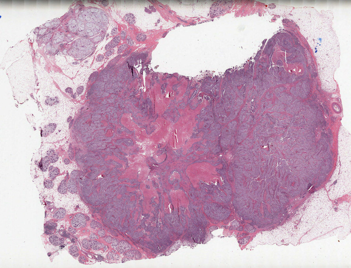 |


A whole-slide image is created by a microscope that scans a slide and combines smaller images into a large image.
Techniques include combining scanned square tiles into a whole-slide image and combining scanned strips
into a resulting whole-slide image. Occasionally, the smaller constituent images can be
visually discerned, as in the shaded area at the top of the slide seen below.

| **Combining Smaller Images into a Whole-Slide Image** |
| -------------------- |
|  |


A fairly unusual feature of whole-slide images is the very large image size.
For our training dataset of 500 images, the width varied from 19,920 pixels to 198,220 pixels,
with an average of 101,688 pixels. The height varied from 13,347 pixels to 256,256 pixels,
with an average of 73,154 pixels. The image total pixel sizes varied from
369,356,640 to 35,621,634,048 pixels, with an average of
7,670,709,628 pixels. The 500 training images take up a total of 525 GB of storage space.

| **Training Image Sizes** |
| -------------------- |
|  |


Here we see a histogram distribution of the training image sizes in megapixels.

| **Distribution of Images Based on Number of Pixels** |
| -------------------- |
|  |


The [OpenSlide](http://openslide.org/) project can be used to read a variety of whole-slide
image formats, including the [Aperio *.svs slide format](http://openslide.org/formats/aperio/)
of our training image set. This is a pyramidal, tiled format, where the massive slide is composed of
a large number of constituent tiles.

To use the OpenSlide Python interface to view whole slide images, we can clone the
[OpenSlide Python interface from GitHub](https://github.com/openslide/openslide-python)
and utilize the included DeepZoom `deepzoom_multiserver.py` script.

    git clone https://github.com/openslide/openslide-python.git
    cd openslide-python/examples/deepzoom
    python3 deepzoom_multiserver.py -Q 100 WSI_DIRECTORY

The `deepzoom_multiserver.py` script starts a web interface on port 5000 and displays
the image files at the specified file system location (the `WSI_DIRECTORY` value above,
which could be a location such as `~/git/python-wsi-preprocessing/data/`). If image
files exist in subdirectories, they will also be displayed in the list of available
slides.

If this viewing application is installed on a server that also hosts the whole-slide image repository, this
offers a convenient mechanism for users to view the slides without requiring local storage space.

| **OpenSlide Available Slides** |
| -------------------- |
| 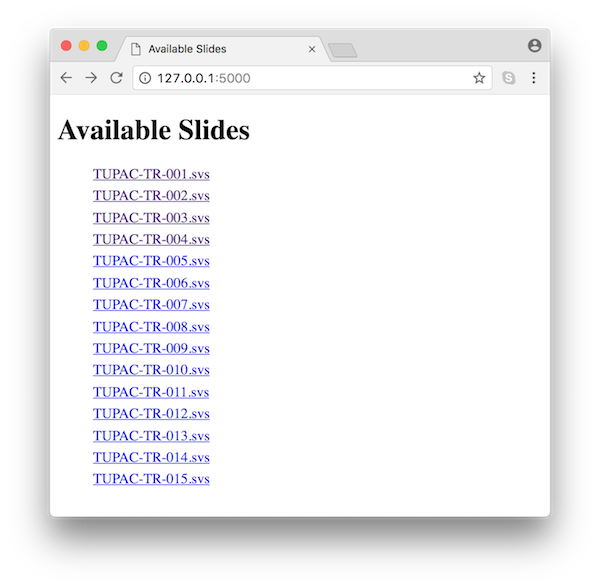 |


Here we can see the initial view of one of the whole-slide images viewed in a web browser.

| **OpenSlide Whole Slide Image** |
| -------------------- |
| 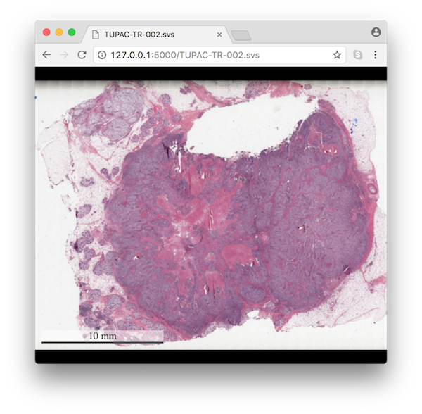 |


Using this web interface, the whole-slide image can be zoomed to the highest magnification, revealing fine details at
the tile level. Zooming and scrolling operations make it relatively easy to visually peruse the whole slide image.

| **OpenSlide Whole Slide Image Zoomed** |
| -------------------- |
| 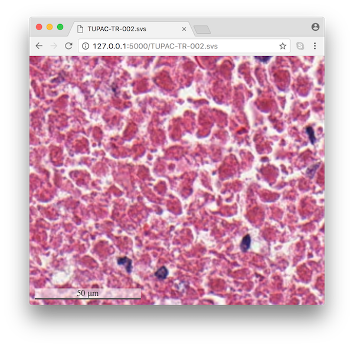 |


## Scale Down Images

To develop a set of filters that can be applied to an entire set of large whole-slide images, two of the first issues
we are confronted with are the size of the data and the format of the data. As mentioned, for our training dataset,
the average `svs` file size is over 1 GB and we have 500 total images. Additionally, the `svs` format is a fairly unusual
format which typically can't be visually displayed by default by common applications and operating systems. Therefore, we will
develop some code to overcome these important issues. Using OpenSlide and Python, we'll convert the training dataset to
smaller images in a common format, thus reformulating a big data problem as a small data problem. Before filtering
at the entire slide level, we will shrink the width and height down by a factor of 32x, which means we can perform
filtering on 1/1024<sup>th</sup> the image data. Converting 500 `svs` files to `png` files at 1/32 scale takes
approximately 12 minutes on a typical MacBook Pro using the code described below.

In the `wsi/slide.py` file, we have many functions that can be used in relation to the original `svs` images. Of
particular importance are the following functions:

    open_slide()
    show_slide()
    slide_info(display_all_properties=True)
    slide_stats()
    training_slide_to_image()
    singleprocess_training_slides_to_images()
    multiprocess_training_slides_to_images()

The `open_slide()` function uses OpenSlide to read in an `svs` file. The `show_slide()` function opens a WSI `svs` file
and displays a scaled-down version of the slide to the screen. The `slide_info()` function displays metadata
associated with all `svs` files. The `slide_stats()` function looks at all images and summarizes size information
about the set of slides. It also generates a variety of charts for a visual representation of the slide statistics.
The `training_slide_to_image()` function converts a single `svs` slide to a smaller image in a more common format such as
`jpg` or `png`. The `singleprocess_training_slides_to_images()` function converts all `svs` slides to smaller images,
and the `multiprocess_training_slides_to_images()` function uses multiple processes (1 process per core) to
speed up the slide conversion process. For the last three functions, when an image is saved, a thumbnail image is also
saved. By default, the thumbnail has a maximum height or width of 300 pixels and is `jpg` format.

One of the first actions we can take to become more familiar with the training dataset is to have a look at the metadata
associated with each image, which we can do with the `slide_info()` function. Here we can see a sample of this
metadata for Slide #1:

```
Opening Slide #1: /Volumes/BigData/TUPAC/training_slides/TUPAC-TR-001.svs
Level count: 5
Level dimensions: ((130304, 247552), (32576, 61888), (8144, 15472), (2036, 3868), (1018, 1934))
Level downsamples: (1.0, 4.0, 16.0, 64.0, 128.0)
Dimensions: (130304, 247552)
Objective power: 40
Associated images:
  macro: <PIL.Image.Image image mode=RGBA size=497x1014 at 0x114B69F98>
  thumbnail: <PIL.Image.Image image mode=RGBA size=404x768 at 0x114B69FD0>
Format: aperio
Properties:
  Property: aperio.AppMag, value: 40
  Property: aperio.MPP, value: 0.16437
  Property: openslide.comment, value: Aperio Image Library v11.0.37
130304x247552 (256x256) JPEG/RGB Q=40;Mirax Digital Slide|AppMag = 40|MPP = 0.16437
  Property: openslide.level-count, value: 5
  Property: openslide.level[0].downsample, value: 1
  Property: openslide.level[0].height, value: 247552
  Property: openslide.level[0].tile-height, value: 256
  Property: openslide.level[0].tile-width, value: 256
  Property: openslide.level[0].width, value: 130304
  Property: openslide.level[1].downsample, value: 4
  Property: openslide.level[1].height, value: 61888
  Property: openslide.level[1].tile-height, value: 256
  Property: openslide.level[1].tile-width, value: 256
  Property: openslide.level[1].width, value: 32576
  Property: openslide.level[2].downsample, value: 16
  Property: openslide.level[2].height, value: 15472
  Property: openslide.level[2].tile-height, value: 256
  Property: openslide.level[2].tile-width, value: 256
  Property: openslide.level[2].width, value: 8144
  Property: openslide.level[3].downsample, value: 64
  Property: openslide.level[3].height, value: 3868
  Property: openslide.level[3].tile-height, value: 256
  Property: openslide.level[3].tile-width, value: 256
  Property: openslide.level[3].width, value: 2036
  Property: openslide.level[4].downsample, value: 128
  Property: openslide.level[4].height, value: 1934
  Property: openslide.level[4].tile-height, value: 256
  Property: openslide.level[4].tile-width, value: 256
  Property: openslide.level[4].width, value: 1018
  Property: openslide.mpp-x, value: 0.16436999999999999
  Property: openslide.mpp-y, value: 0.16436999999999999
  Property: openslide.objective-power, value: 40
  Property: openslide.quickhash-1, value: 0e0631ade42ae3384aaa727ce2e36a8272fe67039c513e17dccfdd592f6040cb
  Property: openslide.vendor, value: aperio
  Property: tiff.ImageDescription, value: Aperio Image Library v11.0.37
130304x247552 (256x256) JPEG/RGB Q=40;Mirax Digital Slide|AppMag = 40|MPP = 0.16437
  Property: tiff.ResolutionUnit, value: inch
```

The most important metadata for our purposes is that the slide has a width of 130,304 pixels and a height of
247,552 pixels. Note that these values are displayed as width followed by height. For most of our image processing,
we will be using NumPy arrays, where rows (height) are followed by columns (width).

If we visually look over the metadata associated with other images in the training dataset, we see that the slides
are not consistent in their various properties such as the number of levels contained in the `svs` files. The metadata
implies that the dataset comes from a variety of sources. The variability in the slides, especially regarding
issues such as H&E staining and pen marks on the slides, needs to be considered during our filter development.

If we call the `slide_stats()` function, in addition to the charts, we obtain a table of pixel statistics, shown
below.

**Training Images Statistics**<br/>

| Attribute  | Size                  | Slide # |
| ---------- | --------------------- | ------- |
| Max width  |        198,220 pixels | 10      |
| Max height |        256,256 pixels | 387     |
| Max size   | 35,621,634,048 pixels | 387     |
| Min width  |         19,920 pixels | 112     |
| Min height |         13,347 pixels | 108     |
| Min size   |    369,356,640 pixels | 112     |
| Avg width  |        101,688 pixels |         |
| Avg height |         73,154 pixels |         |
| Avg size   |  7,670,709,629 pixels |         |


The `wsi/slide.py` file contains constants that can be used to control various image conversion settings. For example,
the `SCALE_FACTOR` constant controls the factor by which the slides will be scaled down. Its default value is 32,
meaning that the height and width will be scaled down by a factor of 32. This means that when we perform filtering,
it will be performed on an image 1/1024<sup>th</sup> the size of the original high-resolution image.
The `DEST_TRAIN_EXT` constant controls the output format. We will use the default format, `png`.

Using macOS, the following conversion times using
`singleprocess_training_slides_to_images()` and `multiprocess_training_slides_to_images()`
on the 500 image training set were obtained:

**Training Image Dataset Conversion Times**<br/>

| Format | Processes      | Time   |
| ------ | -------------- | ------ |
| jpg    | single process | 26m09s  |
| jpg    | multi process  | 10m21s  |
| png    | single process | 42m59s |
| png    | multi process  | 11m58s  |


After calling `multiprocess_training_slides_to_images()` using the `png` format, we have 500 scaled-down
whole-slide images in lossless `png` format that we will examine in greater detail in relation to our filters.


### Image Saving, Displaying, and Conversions

In order to load, save, and display images, we use the Python [Pillow](https://pillow.readthedocs.io/en/4.3.x/)
package. In particular, we make use of the Image module, which contains an Image class used to represent an image.
The `wsi/slide.py` file contains an `open_image()` function to open an image stored in the file system.
The `get_training_image_path()` function takes a slide number and returns the path to the corresponding training image
file, meaning the scaled-down `png` file that we created by calling `multiprocess_training_slides_to_images()`.

If we want to convert a single `svs` WSI file to a scaled-down `png` (without converting all `svs` files),
open that `png` image file as a PIL Image, and display the image to the screen, we can do the following.

```
slide.training_slide_to_image(4)
img_path = slide.get_training_image_path(4)
img = slide.open_image(img_path)
img.show()
```

To mathematically manipulate the images, we use NumPy arrays. The `wsi/util.py` file contains a
`pil_to_np_rgb()` function that converts a PIL Image to a 3-dimensional NumPy array in RGB format. The first dimension
represents the number of rows, the second dimension represents the number of columns, and the third dimension
represents the channel (red, green, and blue).

```
rgb = util.pil_to_np_rgb(img)
```

For convenience, the `display_img()` function can be used to display a NumPy array image. Text can be added to
the displayed image, which can be very useful when visually comparing the results of multiple filters.

```
img_path = slide.get_training_image_path(2)
img = slide.open_image(img_path)
rgb = util.pil_to_np_rgb(img)
util.display_img(rgb, "RGB")
```

| **Display Image with Text** |
| -------------------- |
| 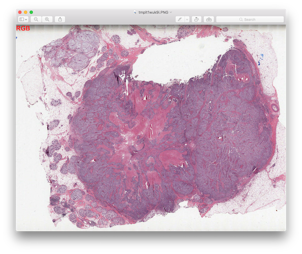 |


When performing operations on NumPy arrays, functions in the `wsi/filter.py` file will often utilize the
`util.np_info()` function to display information about the NumPy array and the amount of time required to perform the
operation. For example, the above call to `pil_to_np_rgb()` internally calls `np_info()`:

```
t = Time()
rgb = np.asarray(pil_img)
np_info(rgb, "RGB", t.elapsed())
return rgb
```

This call to `np_info()` generates console output such as the following:

```
RGB                  | Time: 0:00:00.162484  Type: uint8   Shape: (1385, 1810, 3)
```

We see that the PIL-to-NumPy array conversion took 0.16s. The type of the NumPy array is `uint8`, which means
that each pixel is represented by a red, green, and blue unsigned integer value from 0 to 255. The image has a height of
1385 pixels, a width of 1810 pixels, and three channels (representing red, green, and blue).

We can obtain additional information about NumPy arrays by setting the `util.ADDITIONAL_NP_STATS` constant to `True`.
If we rerun the above code with `ADDITIONAL_NP_STATS = True`, we see the following:

```
RGB                  | Time: 0:00:00.157696 Min:   2.00  Max: 255.00  Mean: 182.62  Binary: F  Type: uint8   Shape: (1385, 1810, 3)
```

The minimum value is 2, the maximum value is 255, the mean value is 182.62, and binary is false, meaning that the
image is not a binary image. A binary image is an image that consists of only two values (True or False, 1.0 or 0.0,
255 or 0). Binary images are produced by actions such as thresholding.

When interacting with NumPy image processing code, the information provided by `np_info()` can be extremely useful.
For example, some functions return boolean NumPy arrays, other functions return float NumPy arrays, and other
functions may return `uint8` NumPy arrays. Before performing actions on a NumPy array, it's usually necessary to know
the data type of the array and the nature of the data in that array. For performance reasons, normally
`ADDITIONAL_NP_STATS` should be set to `False`.

The `wsi/util.py` file contains an `np_to_pil()` function that converts a NumPy array to a PIL Image.

If we have a PIL Image, saving the image to the file system can be accomplished by calling the Image's `save()`
function.

```
img.save(path)
```


## Apply Filters for Tissue Segmentation

Next, we will investigate image filters and will determine a set of filters that can be utilized for effective
tissue segmentation with our dataset.
We will mask out non-tissue by setting non-tissue pixels to 0 for their red, green, and blue channels. For our
particular dataset, our mask will AND together a green channel mask, a grays mask, a red pen mask, a green pen mask,
and a blue pen mask. Following this, we will mask out small objects from the images.

The filtering approach that we develop here has several benefits. All relevant filters are centralized in a single
file, `wsi/filter.py`, for convenience. Filters return results in a standard format and the returned datatype can
easily be changed (`boolean`, `uint8`, `float`). Critical filter debug information (shape, type, processing time, etc)
is output to the console. Filter results can be easily viewed across the entire dataset or subsets of the dataset.
Multiprocessing is used for increased performance. Additionally, filters can easily be combined, strung together,
or otherwise modified.

To filter our scaled-down 500 `png` image training set and generate 4,500 `png` filter preview images and 4,500 `jpg` thumbnails
takes about 23m30s on my MacBook Pro. Filtering the 500 image training set without saving files takes approximately
6 minutes.

### Filters

Let's take a look at several ways that our images can be filtered. Filters are represented by functions
in the `wsi/filter.py` file and have `filter_` prepended to the function names.


#### RGB to Grayscale

A very common task in image processing is to convert an RGB image to a grayscale image. In this process, the three
color channels are replaced by a single grayscale channel. The grayscale pixel value is computed by combining the
red, green, and blue values in set percentages. The `filter_rgb_to_grayscale()` function multiplies the red value by
21.25%, the green value by 71.54%, and the blue value by 7.21%, and these values are added together to obtain the
grayscale pixel value. 

Although the PIL Image `convert("L")` function can also be used to convert an RGB image to a grayscale image, we
will instead use the `filter_rgb_to_grayscale()` function, since having a reference to the RGB image as a NumPy array
can often be very useful during image processing.

Below, we'll open a slide as a PIL Image, convert this to an RGB NumPy array, and then convert this to a grayscale
NumPy array.


```
img_path = slide.get_training_image_path(2)
img = slide.open_image(img_path)
rgb = util.pil_to_np_rgb(img)
grayscale = filter.filter_rgb_to_grayscale(rgb)
util.display_img(grayscale, "Grayscale")
```

Here we see the displayed grayscale image.

| **Grayscale Filter** |
| -------------------- |
| 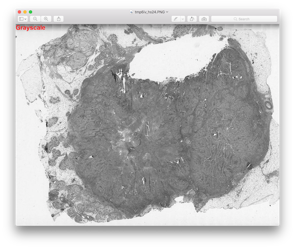 |


In the console, we see that the grayscale image is a two-dimensional NumPy array, since the 3 color channels have
been combined into a single grayscale channel. The data type is `uint8` and pixels are represented by integer
values between 0 and 255.


```
RGB                  | Time: 0:00:00.159974  Type: uint8   Shape: (1385, 1810, 3)
Gray                 | Time: 0:00:00.101953  Type: uint8   Shape: (1385, 1810)
```


#### Complement

In our whole-slide image training set, the slide backgrounds are illuminated by white light, which means that a `uint8`
pixel in the background of a grayscale image is usually close to or equal to 255. However, conceptually and
mathematically it is often useful to have background values close to or equal to 0. For example, this is useful in
thresholding, where we might ask if a pixel value is above a particular threshold value. This can also be useful in
masking out a background of 0 values from an image.

The `filter_complement()` function inverts the values and thus the colors in the NumPy array representation of an image.
Below, we use the `filter_complement()` function to invert the previously obtained grayscale image.

```
img_path = slide.get_training_image_path(2)
img = slide.open_image(img_path)
rgb = util.pil_to_np_rgb(img)
grayscale = filter.filter_rgb_to_grayscale(rgb)
complement = filter.filter_complement(grayscale)
util.display_img(complement, "Complement")
```

| **Complement Filter** |
| -------------------- |
|  |


In the console output, we see that computing the complement is a very fast operation.

```
RGB                  | Time: 0:00:00.177398  Type: uint8   Shape: (1385, 1810, 3)
Gray                 | Time: 0:00:00.105015  Type: uint8   Shape: (1385, 1810)
Complement           | Time: 0:00:00.001439  Type: uint8   Shape: (1385, 1810)
```


#### Thresholding


##### Basic Threshold

With basic thresholding, a binary image is generated, where each value in the resulting NumPy array indicates
whether the corresponding pixel in the original image is above a particular threshold value. So, a
pixel with a value of 160 with a threshold of 150 would generate a True (or 255, or 1.0), and a pixel with a value
of 140 with a threshold of 150 would generate a False (or 0, or 0.0).

Here, we apply a basic threshold with a threshold value of 100 to the grayscale complement of the original image.

```
img_path = slide.get_training_image_path(2)
img = slide.open_image(img_path)
rgb = util.pil_to_np_rgb(img)
grayscale = filter.filter_rgb_to_grayscale(rgb)
complement = filter.filter_complement(grayscale)
thresh = filter.filter_threshold(complement, threshold=100)
util.display_img(thresh, "Threshold")
```

The result is a binary image where pixel values that were above 100 are shown in white and pixel values that were 100 or
lower are shown in black.

| **Basic Threshold Filter** |
| -------------------- |
|  |


In the console output, we see that basic thresholding is a very fast operation.

```
RGB                  | Time: 0:00:00.164464  Type: uint8   Shape: (1385, 1810, 3)
Gray                 | Time: 0:00:00.102431  Type: uint8   Shape: (1385, 1810)
Complement           | Time: 0:00:00.001397  Type: uint8   Shape: (1385, 1810)
Threshold            | Time: 0:00:00.001456  Type: bool    Shape: (1385, 1810)
```


##### Hysteresis Threshold

Hysteresis thresholding is a two-level threshold. The top-level threshold is treated in a similar fashion as basic
thresholding. The bottom-level threshold must be exceeded and must be connected to the top-level threshold. This
processes typically results in much better thresholding than basic thresholding. Reasonable values for the top
and bottom thresholds for images can be determined through experimentation.

The `filter_hysteresis_threshold()` function uses default bottom and top threshold values of 50 and 100. The
default array output type from this function is `uint8`. Since the output of this function is a binary image, the
values in the output array will be either 255 or 0. The output type of this function can be specified using the
`output_type` parameter. Note that when performing masking, it is typically more useful to have a NumPy array of
boolean values.

Here, we perform a hysteresis threshold on the complement of the grayscale image.

```
img_path = slide.get_training_image_path(2)
img = slide.open_image(img_path)
rgb = util.pil_to_np_rgb(img)
grayscale = filter.filter_rgb_to_grayscale(rgb)
complement = filter.filter_complement(grayscale)
hyst = filter.filter_hysteresis_threshold(complement)
util.display_img(hyst, "Hysteresis Threshold")
```

In the displayed image, the result is a binary image. All pixel values are either white (255) or black (0).
The red display text in the corner can be ignored since it is for informational purposes only and is not present when
we save the images to the file system.

Notice that the shadow area along the top edge of the slide makes it through the hysteresis threshold filter even
though conceptually it is background and should not be treated as tissue.

| **Hysteresis Threshold Filter** |
| -------------------- |
| 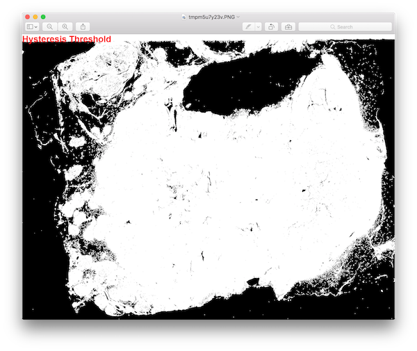 |


Here we see the console output from our filter operations.

```
RGB                  | Time: 0:00:00.167947  Type: uint8   Shape: (1385, 1810, 3)
Gray                 | Time: 0:00:00.109109  Type: uint8   Shape: (1385, 1810)
Complement           | Time: 0:00:00.001453  Type: uint8   Shape: (1385, 1810)
Hysteresis Threshold | Time: 0:00:00.079292  Type: uint8   Shape: (1385, 1810)
```


##### Otsu Threshold

Thresholding using Otsu's method is another popular thresholding technique. This technique was used in the image
processing described in [A Unified Framework for Tumor Proliferation Score Prediction in Breast
Histopathology](https://pdfs.semanticscholar.org/7d9b/ccac7a9a850cc84a980e5abeaeac2aef94e6.pdf). This technique is
described in more detail at
[https://en.wikipedia.org/wiki/Otsu%27s_method](https://en.wikipedia.org/wiki/Otsu%27s_method).

Let's try Otsu's method on the complement image as we did when demonstrating hysteresis thresholding.

```
img_path = slide.get_training_image_path(2)
img = slide.open_image(img_path)
rgb = util.pil_to_np_rgb(img)
grayscale = filter.filter_rgb_to_grayscale(rgb)
complement = filter.filter_complement(grayscale)
otsu = filter.filter_otsu_threshold(complement)
util.display_img(otsu, "Otsu Threshold")
```


In the resulting image, we see that Otsu's method generates roughly similar results as hysteresis thresholding.
However, Otsu's method is less aggressive in terms of what it lets through for the tissue in the upper left
area of the slide. The background shadow area at the top of the slide is passed through the
filter in a similar fashion as hysteresis thresholding. Most of the slides in the training set do not have such a
pronounced shadow area, but it would be nice to have an image processing solution that treats the shadow area as
background.

| **Otsu Threshold Filter** |
| -------------------- |
| 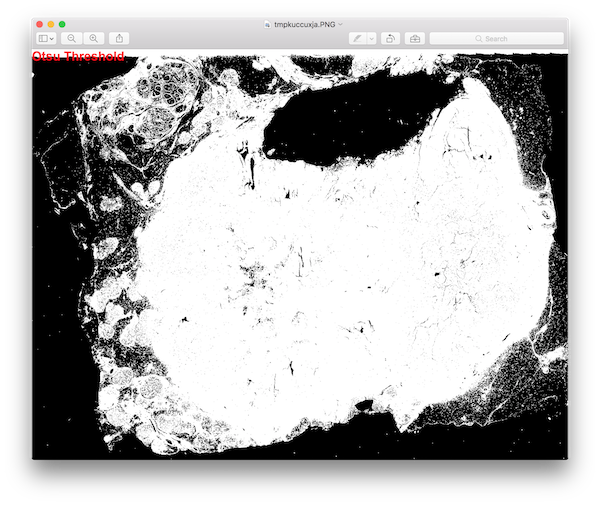 |


In terms of performance, thresholding using Otsu's method is very fast, as we see in the console output.

```
RGB                  | Time: 0:00:00.166855  Type: uint8   Shape: (1385, 1810, 3)
Gray                 | Time: 0:00:00.111960  Type: uint8   Shape: (1385, 1810)
Complement           | Time: 0:00:00.001746  Type: uint8   Shape: (1385, 1810)
Otsu Threshold       | Time: 0:00:00.014615  Type: uint8   Shape: (1385, 1810)
```


#### Contrast

For an image, suppose we have a histogram of the number of pixels (intensity on y-axis) plotted against the range
of possible pixel values (x-axis, 0 to 255). Contrast is a measure of the difference in intensities. An image with
low contrast is typically dull and details are not clearly seen visually. An image with high contrast is typically
sharp and details can clearly be discerned. Increasing the contrast in an image can be used to bring out various details
in the image.


##### Contrast Stretching

One form of increasing the contrast in an image is contrast stretching. Suppose that all intensities in an image occur
between 100 and 150 on a scale from 0 to 255. If we rescale the intensities so that 100 now corresponds to 0 and
150 corresponds to 255 and we linearly rescale the intensities between these points, we have increased the contrast
in the image and differences in detail can more clearly be seen. This is contrast stretching.

As an example, here we perform contrast stretching with a low pixel value of 100 and a high pixel value of 200 on
the complement of the grayscale image.

```
img_path = slide.get_training_image_path(2)
img = slide.open_image(img_path)
rgb = util.pil_to_np_rgb(img)
grayscale = filter.filter_rgb_to_grayscale(rgb)
complement = filter.filter_complement(grayscale)
contrast_stretch = filter.filter_contrast_stretch(complement, low=100, high=200)
util.display_img(contrast_stretch, "Contrast Stretch")
```

This can be used to visually inspect details in the previous intensity range of 100 to 200, since the image filter has
spread out this range across the full spectrum.


| **Contrast Stretching Filter** |
| -------------------- |
|  |


Here we see the console output from this set of filters.

```
RGB                  | Time: 0:00:00.171582  Type: uint8   Shape: (1385, 1810, 3)
Gray                 | Time: 0:00:00.110818  Type: uint8   Shape: (1385, 1810)
Complement           | Time: 0:00:00.002410  Type: uint8   Shape: (1385, 1810)
Contrast Stretch     | Time: 0:00:00.058357  Type: uint8   Shape: (1385, 1810)
```


##### Histogram Equalization

Histogram equalization is another technique that can be used to increase contrast in an image. However, unlike
contrast stretching, which has a linear distribution of the resulting intensities, the histogram equalization
transformation is based on probabilities and is non-linear. For more information about histogram equalization, please
see [https://en.wikipedia.org/wiki/Histogram_equalization](https://en.wikipedia.org/wiki/Histogram_equalization).

As an example, here we display the grayscale image. We increase contrast in the grayscale image using histogram
equalization and display the resulting image.

```
img_path = slide.get_training_image_path(2)
img = slide.open_image(img_path)
rgb = util.pil_to_np_rgb(img)
grayscale = filter.filter_rgb_to_grayscale(rgb)
util.display_img(grayscale, "Grayscale")
hist_equ = filter.filter_histogram_equalization(grayscale)
util.display_img(hist_equ, "Histogram Equalization")
```

Comparing the grayscale image and the image after histogram equalization, we see that contrast in the image has been
increased.

| **Grayscale Filter** | **Histogram Equalization Filter** |
| -------------------- | --------------------------------- |
|  | 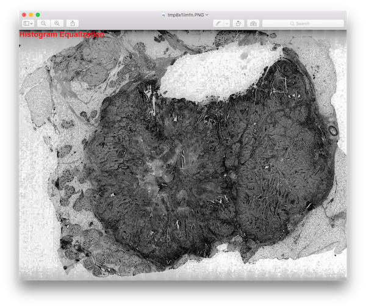 |


Console output following histogram equalization is shown here.

```
RGB                  | Time: 0:00:00.175498  Type: uint8   Shape: (1385, 1810, 3)
Gray                 | Time: 0:00:00.110181  Type: uint8   Shape: (1385, 1810)
Hist Equalization    | Time: 0:00:00.116568  Type: uint8   Shape: (1385, 1810)
```


##### Adaptive Equalization

Rather than applying a single transformation to all pixels in an image, adaptive histogram equalization applies
transformations to local regions in an image. As a result, adaptive equalization allows contrast to be enhanced to
different extents in different regions based on the regions' intensity histograms. For more information about adaptive
equalization, please see
[https://en.wikipedia.org/wiki/Adaptive_histogram_equalization](https://en.wikipedia.org/wiki/Adaptive_histogram_equalization).

The `filter_adaptive_equalization()` function utilizes the scikit-image contrast limited adaptive histogram
equalization (CLAHE) implementation. Below, we apply adaptive equalization to the grayscale image and display both
the grayscale image and the image after adaptive equalization for comparison.

```
img_path = slide.get_training_image_path(2)
img = slide.open_image(img_path)
rgb = util.pil_to_np_rgb(img)
grayscale = filter.filter_rgb_to_grayscale(rgb)
util.display_img(grayscale, "Grayscale")
adaptive_equ = filter.filter_adaptive_equalization(grayscale)
util.display_img(adaptive_equ, "Adaptive Equalization")
```

| **Grayscale Filter** | **Adaptive Equalization Filter** |
| -------------------- | --------------------------------- |
|  |  |


In the console output, we can see that adaptive equalization is more compute-intensive than constrast stretching and
histogram equalization.

```
RGB                  | Time: 0:00:00.167076  Type: uint8   Shape: (1385, 1810, 3)
Gray                 | Time: 0:00:00.106797  Type: uint8   Shape: (1385, 1810)
Adapt Equalization   | Time: 0:00:00.223172  Type: uint8   Shape: (1385, 1810)
```


#### Color

The WSI tissue samples in the training dataset have been H&E stained. Eosin stains basic structures such as
most cytoplasm proteins with a pink tone. Hematoxylin stains acidic structures such as DNA and RNA with a purple
tone. This means that cells tend to be stained pink, and particular areas of the cells such as the nuclei tend to be
stained purple. However, note that appearance can vary greatly based on the types of cells that are stained and the
amounts of stain applied.

As an example of staining differences, below we see a slide that has pink and purple staining next to another slide
where all tissue appears purple.

| **Pink and Purple Slide** | **Purple Slide** |
| -------------------- | --------------------------------- |
|  |  |


Another factor regarding color is that many slides have been marked with red, green, and blue pens. Whereas in general
we would like our filters to include pink and purple colors, since these typically indicate stained tissue, we would
like our filters to exclude red, green, and blue colors, since these typically indicate pen marks on the slides which
are not tissue.

Below, we see an example of a slide that has been marked with red pen and some green pen.

| **Slide Marked with Red and Green Pen** |
| -------------------- |
| 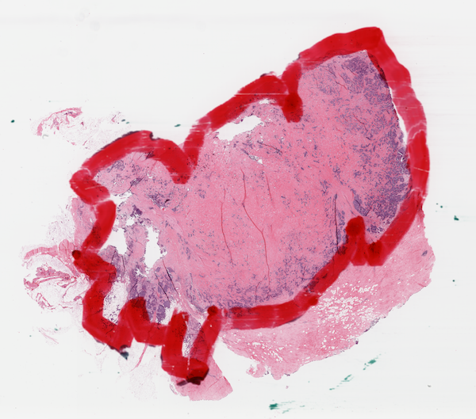 |


Developing color filters that can be used to filter tissue areas can be fairly challenging for a variety of reasons,
including:

1. Filters need to be general enough to work across all slides in the dataset.
2. Filters should handle issues such as variations in shadows and lighting.
3. The amount of H&E (purple and pink) staining can vary greatly from slide to slide.
4. Pen mark colors (red, green, and blue) vary due to issues such as lighting and pen marks over tissue.
5. There can be color overlap between stained tissue and pen marks, so we need to balance how aggressively stain
colors are inclusively filtered and how pen colors are exclusively filtered.


##### RGB to HED

The scikit-image `skimage.color` package features an `rgb2hed()` function that performs color deconvolution on the
original RGB image to create HED (Hematoxylin, Eosin, Diaminobenzidine) channels. The `filter_rgb_to_hed()` function
encapsulates `rgb2hed()`. The `filter_hed_to_hematoxylin()` and `filter_hed_to_eosin()` functions read the hematoxylin
and eosin channels and rescale the resulting 2-dimensional NumPy arrays (for example, 0 to 255 for `uint8`)
to increase contrast.

Here, we'll convert the RGB image to an HED image. We'll then obtain the hematoxylin and eosin channels and display
the resulting images.

```
img_path = slide.get_training_image_path(4)
img = slide.open_image(img_path)
rgb = util.pil_to_np_rgb(img)
hed = filter.filter_rgb_to_hed(rgb)
hema = filter.filter_hed_to_hematoxylin(hed)
util.display_img(hema, "Hematoxylin Channel")
eosin = filter.filter_hed_to_eosin(hed)
util.display_img(eosin, "Eosin Channel")
```

Notice that the hematoxylin channel does fairly well at detecting the purple areas of the original slide,
which could potentially be used to narrow in on tissue with cell nuclei and thus on regions that can be inspected for
mitoses. Both the hematoxylin and eosin channel filters include the background in the resulting image, which is
rather unfortunate in terms of differentiating tissue from non-tissue. Also, notice in the eosin channel that the red
pen is considered to be part of the eosin stain spectrum.


| **Hematoxylin Channel** | **Eosin Channel** |
| -------------------- | --------------------------------- |
|  |  |


Console output:

```
RGB                  | Time: 0:00:00.397570  Type: uint8   Shape: (2594, 2945, 3)
RGB to HED           | Time: 0:00:01.322220  Type: uint8   Shape: (2594, 2945, 3)
HED to Hematoxylin   | Time: 0:00:00.136750  Type: uint8   Shape: (2594, 2945)
HED to Eosin         | Time: 0:00:00.086537  Type: uint8   Shape: (2594, 2945)
```


##### Green Channel Filter

If we look at an RGB color wheel, we see that purple and pink are next to each other. On the other side of color wheel,
we have yellow and green. Since green is one of our 3 NumPy array RGB color channels, filtering out pixels that have a
high green channel value can be one way to potentially filter out parts of the slide that are not pink or purple. This
includes the white background, since white also has a high green channel value along with high red and blue channel
values.

We'll use the default green threshold value of 200 for the `filter_green_channel()` function, meaning that any pixels
with green channel values of 200 or greater will be rejected.

```
img_path = slide.get_training_image_path(2)
img = slide.open_image(img_path)
rgb = util.pil_to_np_rgb(img)
util.display_img(rgb, "RGB")
not_green = filter.filter_green_channel(rgb)
util.display_img(not_green, "Green Channel Filter")
```

The green channel filter does a decent job of differentiating the tissue from the white background. However, notice
that the shadow area at the top of the slide is not excluded by the filter.

| **Original Slide** | **Green Channel Filter** |
| -------------------- | --------------------------------- |
|  |  |

A filter such as the green channel filter most likely would be used in conjunction with other filters for masking
purposes. As a result, the default output type for the green channel filter is `bool`, as we see in the console
output. If another output type is desired, this can be set with the function's `output_type` parameter.

```
RGB                  | Time: 0:00:00.169249  Type: uint8   Shape: (1385, 1810, 3)
Filter Green Channel | Time: 0:00:00.005618  Type: bool    Shape: (1385, 1810)
```


##### Grays Filter

Next, let's utilize a filter that can filter out the annoying shadow area at the top of slide #2. Notice that the
shadow area consists of a gradient of dark-to-light grays. A gray pixel has red, green, and blue channel values that
are close together. The `filter_grays()` function filters out pixels that have red, blue, and green values that
are within a certain tolerance of each other. The default tolerance for `filter_grays()` is 15. The grays filter
also filters out white and black pixels, since they have similar red, green, and blue values.

Here, we run the grays filter on the original RGB image.

```
img_path = slide.get_training_image_path(2)
img = slide.open_image(img_path)
rgb = util.pil_to_np_rgb(img)
util.display_img(rgb, "RGB")
not_grays = filter.filter_grays(rgb)
util.display_img(not_grays, "Grays Filter")
```

Notice that in addition to filtering out the white background, the grays filter has indeed filtered out the shadow
area at the top of the slide.

| **Original Slide** | **Grays Filter** |
| -------------------- | --------------------------------- |
|  |  |

Like the green channel filter, the default type of the returned array is `bool` since the grays filter will typically
be used in combination with other filters. Since the grays filter is fast, it offers a potentially
low-cost way to filter out shadows from the slides during preprocessing.

```
RGB                  | Time: 0:00:00.169642  Type: uint8   Shape: (1385, 1810, 3)
Filter Grays         | Time: 0:00:00.082075  Type: bool    Shape: (1385, 1810)
```


##### Red Filter

Next, let's turn our attention to filtering out shades of red, which can be used to filter out a significant amount of
the red pen color. The red pen consists of a wide variety of closely related red shades. Certain shades are
reddish, others are maroonish, and others are pinkish, for example. These color gradations are a result of a variety of
factors, such as the amount of ink, lighting, shadowing, and tissue under the pen marks.

The `filter_red()` function filters out reddish colors through a red channel lower threshold value, a green channel
upper threshold value, and a blue channel upper threshold value. The generated mask is based on a pixel being above
the red channel threshold value and below the green and blue channel threshold values. One way to determine these
values is to display the slide image in a web browser and use a tool such as the Chrome ColorPick Eyedropper to
click on a red pen pixel to determine the approximate red, green, and blue values.

In this example with slide #4, we use a red threshold value of 150, a green threshold value of 80, and a blue
threshold value of 90. In addition, to help us visualize the filter results, we apply the red filter to the
original RGB image as a mask and also apply the inverse of the red filter to the original image as a mask.

```
img_path = slide.get_training_image_path(4)
img = slide.open_image(img_path)
rgb = util.pil_to_np_rgb(img)
util.display_img(rgb, "RGB")
not_red = filter.filter_red(rgb, red_lower_thresh=150, green_upper_thresh=80, blue_upper_thresh=90, display_np_info=True)
util.display_img(not_red, "Red Filter (150, 80, 90)")
util.display_img(util.mask_rgb(rgb, not_red), "Not Red")
util.display_img(util.mask_rgb(rgb, ~not_red), "Red")
```

We see that the red filter filters out much of the red pen.

| **Original Slide** | **Red Filter** |
| -------------------- | --------------------------------- |
|  |  |


Applying the red filter and the inverse of the red filter as masks to the original image, we see that our threshold
values did quite well at filtering out a large amount of the red pen.

| **Not Red** | **Red** |
| -------------------- | --------------------------------- |
|  | 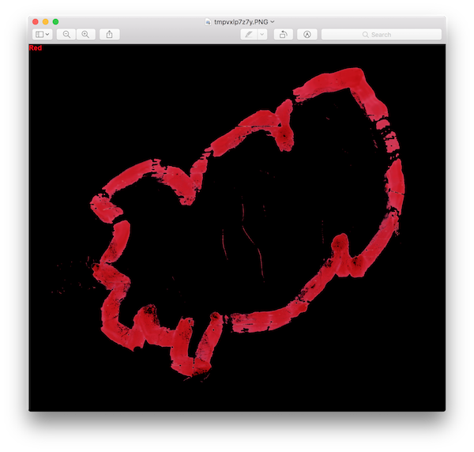 |


Here we see the console output from the above image filtering:

```
RGB                  | Time: 0:00:00.404069  Type: uint8   Shape: (2594, 2945, 3)
Filter Red           | Time: 0:00:00.034864  Type: bool    Shape: (2594, 2945)
Mask RGB             | Time: 0:00:00.053997  Type: uint8   Shape: (2594, 2945, 3)
Mask RGB             | Time: 0:00:00.022750  Type: uint8   Shape: (2594, 2945, 3)
```


##### Red Pen Filter

Next, let's turn our attention to a more inclusive red pen filter that handles more shades of red. Since the
`filter_red()` function returns a boolean array result, we can combine multiple sets of `filter_red()` threshold
values (`red_lower_thresh`, `green_upper_thresh`, `blue_upper_thresh`) using boolean operators such as `&`. We can
determine these values using a color picker tool such as the Chrome ColorPick Eyedropper, as mentioned previously.
In addition to determining various shades of red pen on a single slide, shades of red pen from other slides should be
identified and included. Note that we need to be careful with pinkish shades of red due to the similarity of these
shades to eosin staining.

Using the color picker technique, the `filter_red_pen()` function utilizes the following sets of red threshold values.

```
result = filter_red(rgb, red_lower_thresh=150, green_upper_thresh=80, blue_upper_thresh=90) & \
         filter_red(rgb, red_lower_thresh=110, green_upper_thresh=20, blue_upper_thresh=30) & \
         filter_red(rgb, red_lower_thresh=185, green_upper_thresh=65, blue_upper_thresh=105) & \
         filter_red(rgb, red_lower_thresh=195, green_upper_thresh=85, blue_upper_thresh=125) & \
         filter_red(rgb, red_lower_thresh=220, green_upper_thresh=115, blue_upper_thresh=145) & \
         filter_red(rgb, red_lower_thresh=125, green_upper_thresh=40, blue_upper_thresh=70) & \
         filter_red(rgb, red_lower_thresh=200, green_upper_thresh=120, blue_upper_thresh=150) & \
         filter_red(rgb, red_lower_thresh=100, green_upper_thresh=50, blue_upper_thresh=65) & \
         filter_red(rgb, red_lower_thresh=85, green_upper_thresh=25, blue_upper_thresh=45)
```

Let's apply the red pen filter to slide #4.

```
img_path = slide.get_training_image_path(4)
img = slide.open_image(img_path)
rgb = util.pil_to_np_rgb(img)
util.display_img(rgb, "RGB")
not_red_pen = filter.filter_red_pen(rgb)
util.display_img(not_red_pen, "Red Pen Filter")
util.display_img(util.mask_rgb(rgb, not_red_pen), "Not Red Pen")
util.display_img(util.mask_rgb(rgb, ~not_red_pen), "Red Pen")
```

| **Original Slide** | **Red Pen Filter** |
| -------------------- | --------------------------------- |
|  | 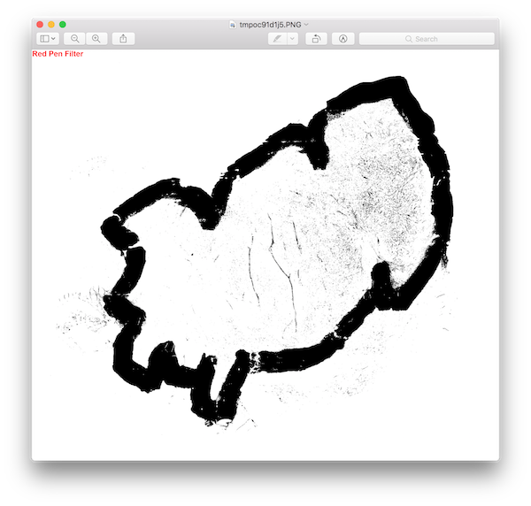 |

Compared with using a single set of red threshold values, we can see that the red pen filter is significantly
more inclusive in terms of the shades of red that are accepted. As a result, more red pen is filtered. However, notice
that some of the pinkish-red from eosin-stained tissue is also included as a result of this more aggressive filtering.


| **Not Red Pen** | **Red Pen** |
| -------------------- | --------------------------------- |
| 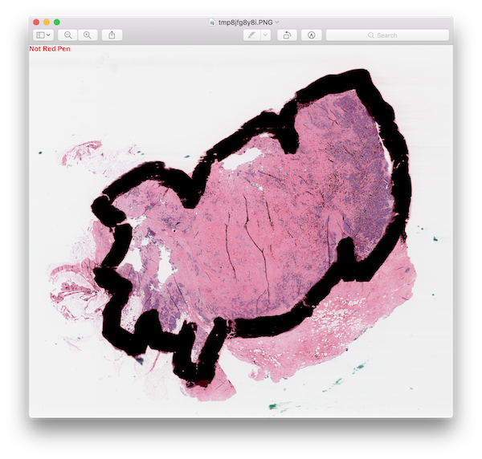 |  |


Even though the red pen filter ANDs nine sets of red filter results together, we see that the performance is excellent.

```
RGB                  | Time: 0:00:00.392082  Type: uint8   Shape: (2594, 2945, 3)
Filter Red Pen       | Time: 0:00:00.251170  Type: bool    Shape: (2594, 2945)
Mask RGB             | Time: 0:00:00.037256  Type: uint8   Shape: (2594, 2945, 3)
Mask RGB             | Time: 0:00:00.026589  Type: uint8   Shape: (2594, 2945, 3)
```

##### Blue Filter

If we visually examine the 500 slides in the training dataset, we see that several of the slides have been marked
with blue pen. Rather than blue lines, many of the blue marks consist of blue dots surrounding particular areas of
interest on the slides, although this is not always the case. Some of the slides also have blue pen lines. Once again,
the blue pen marks consist of several gradations of blue.

We'll start by creating a filter to filter out blue. The `filter_blue()` function operates in a similar way as the
`filter_red()` function. It takes a red channel upper threshold value, a green channel upper threshold value, and
a blue channel lower threshold value. The generated mask is based on a pixel being below the red channel threshold
value, below the green channel threshold value, and above the blue channel threshold value.

Once again, we'll apply the results of the blue filter and the inverse of the blue filter as masks to the original
RGB image to help visualize the filter results.

```
img_path = slide.get_training_image_path(241)
img = slide.open_image(img_path)
rgb = util.pil_to_np_rgb(img)
util.display_img(rgb, "RGB")
not_blue = filter.filter_blue(rgb, red_upper_thresh=130, green_upper_thresh=155, blue_lower_thresh=180, display_np_info=True)
util.display_img(not_blue, "Blue Filter (130, 155, 180)")
util.display_img(util.mask_rgb(rgb, not_blue), "Not Blue")
util.display_img(util.mask_rgb(rgb, ~not_blue), "Blue")
```

We see that a lot of the blue pen has been filtered out.

| **Original Slide** | **Blue Filter** |
| -------------------- | --------------------------------- |
|  | 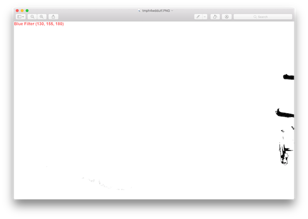 |


| **Not Blue** | **Blue** |
| -------------------- | --------------------------------- |
| 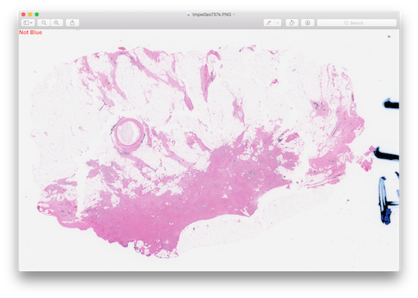 |  |


Console output:

```
RGB                  | Time: 0:00:00.432772  Type: uint8   Shape: (2058, 3240, 3)
Filter Blue          | Time: 0:00:00.029066  Type: bool    Shape: (2058, 3240)
Mask RGB             | Time: 0:00:00.038966  Type: uint8   Shape: (2058, 3240, 3)
Mask RGB             | Time: 0:00:00.021153  Type: uint8   Shape: (2058, 3240, 3)
```


##### Blue Pen Filter

In `filter_blue_pen()`, we AND together various blue shade ranges using `filter_blue()` with
sets of red, green, and blue threshold values to create a blue pen filter that filters out various shades of blue.

```
result = filter_blue(rgb, red_upper_thresh=60, green_upper_thresh=120, blue_lower_thresh=190) & \
         filter_blue(rgb, red_upper_thresh=120, green_upper_thresh=170, blue_lower_thresh=200) & \
         filter_blue(rgb, red_upper_thresh=175, green_upper_thresh=210, blue_lower_thresh=230) & \
         filter_blue(rgb, red_upper_thresh=145, green_upper_thresh=180, blue_lower_thresh=210) & \
         filter_blue(rgb, red_upper_thresh=37, green_upper_thresh=95, blue_lower_thresh=160) & \
         filter_blue(rgb, red_upper_thresh=30, green_upper_thresh=65, blue_lower_thresh=130) & \
         filter_blue(rgb, red_upper_thresh=130, green_upper_thresh=155, blue_lower_thresh=180) & \
         filter_blue(rgb, red_upper_thresh=40, green_upper_thresh=35, blue_lower_thresh=85) & \
         filter_blue(rgb, red_upper_thresh=30, green_upper_thresh=20, blue_lower_thresh=65) & \
         filter_blue(rgb, red_upper_thresh=90, green_upper_thresh=90, blue_lower_thresh=140) & \
         filter_blue(rgb, red_upper_thresh=60, green_upper_thresh=60, blue_lower_thresh=120) & \
         filter_blue(rgb, red_upper_thresh=110, green_upper_thresh=110, blue_lower_thresh=175)
```

We apply the filter and its inverse to the original slide to help us visualize the results.

```
img_path = slide.get_training_image_path(241)
img = slide.open_image(img_path)
rgb = util.pil_to_np_rgb(img)
util.display_img(rgb, "RGB")
not_blue_pen = filter.filter_blue_pen(rgb)
util.display_img(not_blue_pen, "Blue Pen Filter")
util.display_img(util.mask_rgb(rgb, not_blue_pen), "Not Blue Pen")
util.display_img(util.mask_rgb(rgb, ~not_blue_pen), "Blue Pen")
```

For this slide, we see that `filter_blue_pen()` filters out more blue than the previous `filter_blue()` example.

| **Original Slide** | **Blue Pen Filter** |
| -------------------- | --------------------------------- |
|  |  |


| **Not Blue Pen** | **Blue Pen** |
| -------------------- | --------------------------------- |
|  |  |


We see from the console output that the blue pen filter is quite fast.

```
RGB                  | Time: 0:00:00.348514  Type: uint8   Shape: (2058, 3240, 3)
Filter Blue Pen      | Time: 0:00:00.288286  Type: bool    Shape: (2058, 3240)
Mask RGB             | Time: 0:00:00.033348  Type: uint8   Shape: (2058, 3240, 3)
Mask RGB             | Time: 0:00:00.019622  Type: uint8   Shape: (2058, 3240, 3)
```

As an aside, we can quantify the differences in filtering between the `filter_blue()` and `filter_blue_pen()`
results.

```
not_blue = filter.filter_blue(rgb, red_upper_thresh=130, green_upper_thresh=155, blue_lower_thresh=180, display_np_info=True)
not_blue_pen = filter.filter_blue_pen(rgb)
print("filter_blue: " + filter.mask_percentage_text(filter.mask_percent(not_blue)))
print("filter_blue_pen: " + filter.mask_percentage_text(filter.mask_percent(not_blue_pen)))
```

The `filter_blue()` example filters out 0.45% of the slide pixels and the `filter_blue_pen()` example filters out
0.69% of the slide pixels.

```
filter_blue: 0.45%
filter_blue_pen: 0.69%
```

##### Green Filter

We utilize the `filter_green()` function to filter green color shades. Using a color picker tool,
if we examine the green pen marks on the slides, the green and blue channel
values for pixels appear to track together. As a result of this, this function has a red channel upper
threshold value, a green channel lower threshold value, and a blue channel lower threshold value.

```
img_path = slide.get_training_image_path(51)
img = slide.open_image(img_path)
rgb = util.pil_to_np_rgb(img)
util.display_img(rgb, "RGB")
not_green = filter.filter_green(rgb, red_upper_thresh=150, green_lower_thresh=160, blue_lower_thresh=140, display_np_info=True)
util.display_img(not_green, "Green Filter (150, 160, 140)")
util.display_img(util.mask_rgb(rgb, not_green), "Not Green")
util.display_img(util.mask_rgb(rgb, ~not_green), "Green")
```

Using a red upper threshold of 150, a green lower threshold of 160, and a blue lower threshold of 140, we see that the
much of the green ink above the background is filtered out, but most of the green ink above the tissue is not filtered
out.

| **Original Slide** | **Green Filter** |
| -------------------- | --------------------------------- |
|  | 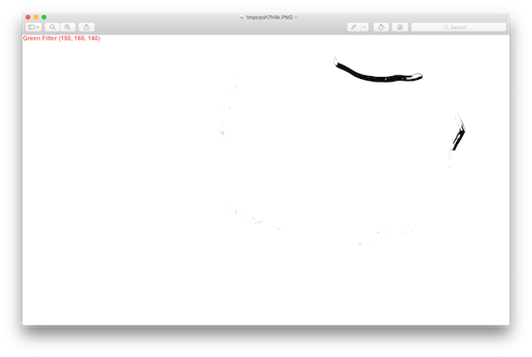 |


| **Not Green** | **Green** |
| -------------------- | --------------------------------- |
|  |  |


Console output:

```
RGB                  | Time: 0:00:00.611914  Type: uint8   Shape: (2291, 3839, 3)
Filter Green         | Time: 0:00:00.077429  Type: bool    Shape: (2291, 3839)
Mask RGB             | Time: 0:00:00.049026  Type: uint8   Shape: (2291, 3839, 3)
Mask RGB             | Time: 0:00:00.027211  Type: uint8   Shape: (2291, 3839, 3)
```

##### Green Pen Filter

To handle the green pen shades, the `filter_green_pen()` function combines different shade results using sets of
red, green, and blue threshold values passed to the `filter_green()` function.

```
result = filter_green(rgb, red_upper_thresh=150, green_lower_thresh=160, blue_lower_thresh=140) & \
         filter_green(rgb, red_upper_thresh=70, green_lower_thresh=110, blue_lower_thresh=110) & \
         filter_green(rgb, red_upper_thresh=45, green_lower_thresh=115, blue_lower_thresh=100) & \
         filter_green(rgb, red_upper_thresh=30, green_lower_thresh=75, blue_lower_thresh=60) & \
         filter_green(rgb, red_upper_thresh=195, green_lower_thresh=220, blue_lower_thresh=210) & \
         filter_green(rgb, red_upper_thresh=225, green_lower_thresh=230, blue_lower_thresh=225) & \
         filter_green(rgb, red_upper_thresh=170, green_lower_thresh=210, blue_lower_thresh=200) & \
         filter_green(rgb, red_upper_thresh=20, green_lower_thresh=30, blue_lower_thresh=20) & \
         filter_green(rgb, red_upper_thresh=50, green_lower_thresh=60, blue_lower_thresh=40) & \
         filter_green(rgb, red_upper_thresh=30, green_lower_thresh=50, blue_lower_thresh=35) & \
         filter_green(rgb, red_upper_thresh=65, green_lower_thresh=70, blue_lower_thresh=60) & \
         filter_green(rgb, red_upper_thresh=100, green_lower_thresh=110, blue_lower_thresh=105) & \
         filter_green(rgb, red_upper_thresh=165, green_lower_thresh=180, blue_lower_thresh=180) & \
         filter_green(rgb, red_upper_thresh=140, green_lower_thresh=140, blue_lower_thresh=150) & \
         filter_green(rgb, red_upper_thresh=185, green_lower_thresh=195, blue_lower_thresh=195)
```

If we apply the green pen filter, we see that it includes most of the green shades above the tissue in slide 51.

```
img_path = slide.get_training_image_path(51)
img = slide.open_image(img_path)
rgb = util.pil_to_np_rgb(img)
util.display_img(rgb, "RGB")
not_green_pen = filter.filter_green_pen(rgb)
util.display_img(not_green_pen, "Green Pen Filter")
util.display_img(util.mask_rgb(rgb, not_green_pen), "Not Green Pen")
util.display_img(util.mask_rgb(rgb, ~not_green_pen), "Green Pen")
```

| **Original Slide** | **Green Pen Filter** |
| -------------------- | --------------------------------- |
|  |  |


| **Not Green Pen** | **Green Pen** |
| -------------------- | --------------------------------- |
| 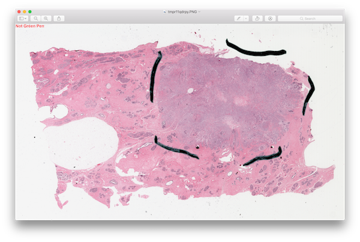 | 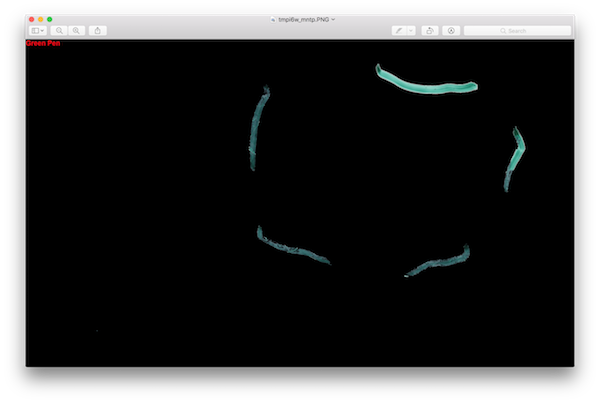 |


Like the other pen filters, the green pen filter's performance is quite good.

```
RGB                  | Time: 0:00:00.540223  Type: uint8   Shape: (2291, 3839, 3)
Filter Green Pen     | Time: 0:00:00.487728  Type: bool    Shape: (2291, 3839)
Mask RGB             | Time: 0:00:00.044024  Type: uint8   Shape: (2291, 3839, 3)
Mask RGB             | Time: 0:00:00.022867  Type: uint8   Shape: (2291, 3839, 3)
```


##### K-Means Segmentation

The scikit-image library contains functionality that allows for image segmentation using k-means clustering based
on location and color. This allows regions of similarly colored pixels to be grouped together. These regions are
colored based on the average color of the pixels in the individual regions. This could potentially be used to filter
regions based on their colors, where we could filter on pink shades for eosin-stained tissue and purple shades for
hematoxylin-stained tissue.

The `filter_kmeans_segmentation()` function has a default value of 800 segments. We'll increase this to 3000 using
the `n_segments` parameter. In the example below, we'll perform k-means segmentation on the original image. In
addition, we'll create a threshold using Otsu's method and apply the resulting mask to the original image. We'll then
perform k-means segmentation on that image.

```
img_path = slide.get_training_image_path(2)
img = slide.open_image(img_path)
rgb = util.pil_to_np_rgb(img)
util.display_img(rgb, "Original", bg=True)
kmeans_seg = filter.filter_kmeans_segmentation(rgb, n_segments=3000)
util.display_img(kmeans_seg, "K-Means Segmentation", bg=True)
otsu_mask = util.mask_rgb(rgb, filter.filter_otsu_threshold(filter.filter_complement(filter.filter_rgb_to_grayscale(rgb)), output_type="bool"))
util.display_img(otsu_mask, "Image after Otsu Mask", bg=True)
kmeans_seg_otsu = filter.filter_kmeans_segmentation(otsu_mask, n_segments=3000)
util.display_img(kmeans_seg_otsu, "K-Means Segmentation after Otsu Mask", bg=True)
```


| **Original Slide** | **K-Means Segmentation** |
| -------------------- | --------------------------------- |
|  |  |


| **Image after Otsu Mask** | **K-Means Segmentation after Otsu Mask** |
| -------------------- | --------------------------------- |
|  | 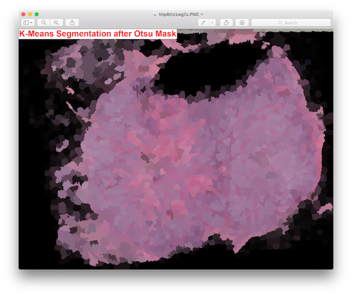 |


Note that there are a couple practical difficulties in terms of implementing automated tissue detection using k-means
segmentation. To begin with, due to the variation in tissue stain colors across the image dataset, it can be difficult
to filter on "pinkish" and "purplish" colors across all the slides. In addition, the k-means segmentation technique
is very computationally expensive, as we can see in the console output. The compute time increases with the number
of segments. For 3000 segments, we have a filter time of ~20 seconds, whereas all operations that we have seen up to
this point are subsecond. If we use the default value of 800 segments, compute time for the k-means segmentation filter
is ~7 seconds.

```
RGB                  | Time: 0:00:00.172848  Type: uint8   Shape: (1385, 1810, 3)
K-Means Segmentation | Time: 0:00:20.238886  Type: uint8   Shape: (1385, 1810, 3)
Gray                 | Time: 0:00:00.076287  Type: uint8   Shape: (1385, 1810)
Complement           | Time: 0:00:00.000374  Type: uint8   Shape: (1385, 1810)
Otsu Threshold       | Time: 0:00:00.013864  Type: bool    Shape: (1385, 1810)
Mask RGB             | Time: 0:00:00.008522  Type: uint8   Shape: (1385, 1810, 3)
K-Means Segmentation | Time: 0:00:20.130044  Type: uint8   Shape: (1385, 1810, 3)
```

---

The sci-kit image library also makes it possible to combine similarly colored regions. One way to do this with the
k-means segmentation results is to build a region adjacency graph (RAG) and combine regions based on a threshold value.
The `filter_rag_threshold()` function performs k-means segmentation, builds the RAG, and allows us to pass in the RAG
threshold value.

Here, we perform k-means segmentation, build a RAG, and apply different RAG thresholds to combine similar regions.

```
img_path = slide.get_training_image_path(2)
img = slide.open_image(img_path)
rgb = util.pil_to_np_rgb(img)
util.display_img(rgb, "Original", bg=True)
rag_thresh = filter.filter_rag_threshold(rgb)
util.display_img(rag_thresh, "RAG Threshold (9)", bg=True)
rag_thresh = filter.filter_rag_threshold(rgb, threshold=1)
util.display_img(rag_thresh, "RAG Threshold (1)", bg=True)
rag_thresh = filter.filter_rag_threshold(rgb, threshold=20)
util.display_img(rag_thresh, "RAG Threshold (20)", bg=True)
```

| **Original Slide** | **RAG Threshold = 9** |
| -------------------- | --------------------------------- |
|  | 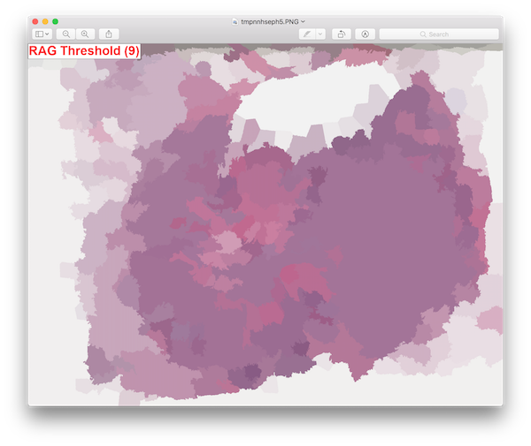 |


| **RAG Threshold = 1** | **RAG Threshold = 20** |
| -------------------- | --------------------------------- |
| 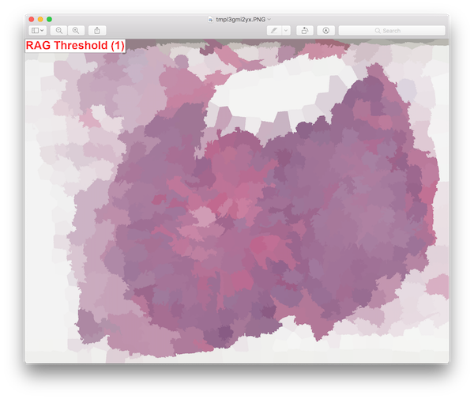 | 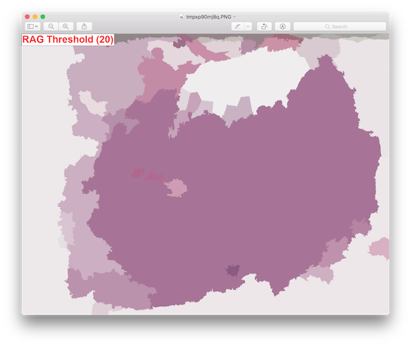 |


Even using the default 800 number of segments for the k-means segmentation, we see that this technique is very
computationally expensive.

```
RGB                  | Time: 0:00:00.462239  Type: uint8   Shape: (1385, 1810, 3)
RAG Threshold        | Time: 0:00:24.677776  Type: uint8   Shape: (1385, 1810, 3)
RAG Threshold        | Time: 0:00:26.683581  Type: uint8   Shape: (1385, 1810, 3)
RAG Threshold        | Time: 0:00:23.774296  Type: uint8   Shape: (1385, 1810, 3)
```


##### RGB to HSV

Comparing hematoxylin and eosin staining can be challenging in the RGB color space. One way to simplify
this comparison is to convert to a different color space such as HSV (Hue-Saturation-Value).
The scikit-image `skimage.color` package features an `rgb2hsv()` function that converts an RGB image
to an HSV image. The `filter_rgb_to_hsv()` function wraps this scikit-image function.
In the HSV color model, the hue is represented by 360 degrees. Purple has a hue of 270 and
pink has a hue of 330. We discuss hematoxylin and eosin stain comparison in our later discussion
of tile scoring, where we favor hematoxylin-stained tissue over eosin-stained tissue.

As an example, in the `wsi/tiles.py` file, the `display_image_with_rgb_and_hsv_histograms()`
function takes in an image as a NumPy array in RGB color space and displays the image
along with its RGB and HSV histograms. Internally, this function utilizes the `filter_rgb_to_hsv()`
function.


```
# To get around renderer issue on OSX going from Matplotlib image to NumPy image.
import matplotlib
matplotlib.use('Agg')

from deephistopath.wsi import slide
from deephistopath.wsi import tiles
from deephistopath.wsi import util

img_path = slide.get_training_image_path(2)
img = slide.open_image(img_path)
rgb = util.pil_to_np_rgb(img)
tiles.display_image_with_rgb_and_hsv_histograms(rgb)
```

Here we see slide #2 along with its RGB and HSV histograms. Notice that the HSV hue histogram
columns have additionally been colored based on their corresponding hue values to aid in
visual inspection.

| **Slide 2 RGB and HSV Histograms** |
| -------------------- |
|  |


#### Morphology

Information about image morphology can be found at
[https://en.wikipedia.org/wiki/Mathematical_morphology](https://en.wikipedia.org/wiki/Mathematical_morphology).
The primary morphology operators are erosion, dilation, opening, and closing. With erosion, pixels along the edges
of an object are removed. With dilation, pixels along the edges of an object are added. Opening is erosion followed
by dilation. Closing is dilation followed by erosion. With morphology operators, a structuring element (such as
a square, circle, cross, etc) is passed along the edges of the objects to perform the operations. Morphology operators
are typically performed on binary and grayscale images. In our examples, we apply morphology operators to binary
images (2-dimensional arrays of 2 values, such as True/False, 1.0/0.0, and 255/0).


##### Erosion

Let's have a look at an erosion example.
We create a binary image by calling the `filter_grays()` function on the original RGB image. The
`filter_binary_erosion()` function uses a disk as the structuring element that erodes the edges of the
"No Grays" binary image. We demonstrate erosion with disk structuring elements of radius 5 and radius 20.

```
img_path = slide.get_training_image_path(2)
img = slide.open_image(img_path)
rgb = util.pil_to_np_rgb(img)
util.display_img(rgb, "Original", bg=True)
no_grays = filter.filter_grays(rgb, output_type="bool")
util.display_img(no_grays, "No Grays", bg=True)
bin_erosion_5 = filter.filter_binary_erosion(no_grays, disk_size=5)
util.display_img(bin_erosion_5, "Binary Erosion (5)", bg=True)
bin_erosion_20 = filter.filter_binary_erosion(no_grays, disk_size=20)
util.display_img(bin_erosion_20, "Binary Erosion (20)", bg=True)
```

| **Original Slide** | **No Grays** |
| -------------------- | --------------------------------- |
| 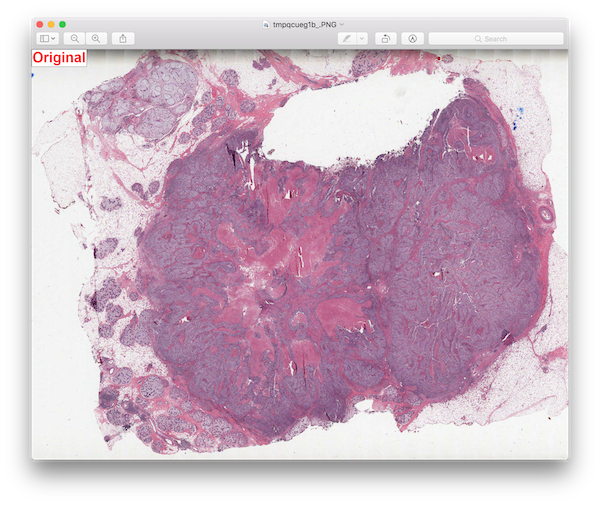 |  |


| **Binary Erosion (disk_size = 5)** | **Binary Erosion (disk_size = 20)** |
| -------------------- | --------------------------------- |
| ") | ") |


Notice that increasing the structuring element radius increases the compute time.

```
RGB                  | Time: 0:00:00.171309  Type: uint8   Shape: (1385, 1810, 3)
Filter Grays         | Time: 0:00:00.086484  Type: bool    Shape: (1385, 1810)
Binary Erosion       | Time: 0:00:00.167290  Type: uint8   Shape: (1385, 1810)
Binary Erosion       | Time: 0:00:00.765442  Type: uint8   Shape: (1385, 1810)
```


##### Dilation

The `filter_binary_dilation()` function utilizes a disk structuring element in a similar manner as the corresponding
erosion function. We'll utilize the same "No Grays" binary image from the previous example and dilate the image
utilizing a disk radius of 5 pixels followed by a disk radius of 20 pixels.

```
img_path = slide.get_training_image_path(2)
img = slide.open_image(img_path)
rgb = util.pil_to_np_rgb(img)
util.display_img(rgb, "Original", bg=True)
no_grays = filter.filter_grays(rgb, output_type="bool")
util.display_img(no_grays, "No Grays", bg=True)
bin_dilation_5 = filter.filter_binary_dilation(no_grays, disk_size=5)
util.display_img(bin_dilation_5, "Binary Dilation (5)", bg=True)
bin_dilation_20 = filter.filter_binary_dilation(no_grays, disk_size=20)
util.display_img(bin_dilation_20, "Binary Dilation (20)", bg=True)
```

We see that dilation expands the edges of the binary image as opposed to the erosion, which shrinks the edges.

| **Binary Dilation (disk_size = 5)** | **Binary Dilation (disk_size = 20)** |
| -------------------- | --------------------------------- |
| ") | ") |


Console output:

```
RGB                  | Time: 0:00:00.176491  Type: uint8   Shape: (1385, 1810, 3)
Filter Grays         | Time: 0:00:00.081817  Type: bool    Shape: (1385, 1810)
Binary Dilation      | Time: 0:00:00.096302  Type: uint8   Shape: (1385, 1810)
Binary Dilation      | Time: 0:00:00.538761  Type: uint8   Shape: (1385, 1810)
```


##### Opening

As mentioned, opening is erosion followed by dilation. Opening can be used to remove small foreground objects.


```
img_path = slide.get_training_image_path(2)
img = slide.open_image(img_path)
rgb = util.pil_to_np_rgb(img)
util.display_img(rgb, "Original", bg=True)
no_grays = filter.filter_grays(rgb, output_type="bool")
util.display_img(no_grays, "No Grays", bg=True)
bin_opening_5 = filter.filter_binary_opening(no_grays, disk_size=5)
util.display_img(bin_opening_5, "Binary Opening (5)", bg=True)
bin_opening_20 = filter.filter_binary_opening(no_grays, disk_size=20)
util.display_img(bin_opening_20, "Binary Opening (20)", bg=True)
```

| **Binary Opening (disk_size = 5)** | **Binary Opening (disk_size = 20)** |
| -------------------- | --------------------------------- |
| ") | ") |


Opening is a fairly expensive operation, since it is an erosion followed by a dilation. The compute time increases
with the size of the structuring element. The 5-pixel disk radius for the structuring element results in a 0.25s
operation, whereas the 20-pixel disk radius results in a 2.45s operation.

```
RGB                  | Time: 0:00:00.169241  Type: uint8   Shape: (1385, 1810, 3)
Filter Grays         | Time: 0:00:00.085474  Type: bool    Shape: (1385, 1810)
Binary Opening       | Time: 0:00:00.248629  Type: uint8   Shape: (1385, 1810)
Binary Opening       | Time: 0:00:02.452089  Type: uint8   Shape: (1385, 1810)
```


##### Closing

Closing is a dilation followed by an erosion. Closing can be used to remove small background holes.


```
img_path = slide.get_training_image_path(2)
img = slide.open_image(img_path)
rgb = util.pil_to_np_rgb(img)
util.display_img(rgb, "Original", bg=True)
no_grays = filter.filter_grays(rgb, output_type="bool")
util.display_img(no_grays, "No Grays", bg=True)
bin_closing_5 = filter.filter_binary_closing(no_grays, disk_size=5)
util.display_img(bin_closing_5, "Binary Closing (5)", bg=True)
bin_closing_20 = filter.filter_binary_closing(no_grays, disk_size=20)
util.display_img(bin_closing_20, "Binary Closing (20)", bg=True)
```

| **Binary Closing (disk_size = 5)** | **Binary Closing (disk_size = 20)** |
| -------------------- | --------------------------------- |
| ") | ") |


Like opening, closing is a fairly expensive operation since it performs both a dilation and an erosion. Compute time
increases with structuring element size.

```
RGB                  | Time: 0:00:00.179190  Type: uint8   Shape: (1385, 1810, 3)
Filter Grays         | Time: 0:00:00.079992  Type: bool    Shape: (1385, 1810)
Binary Closing       | Time: 0:00:00.241882  Type: uint8   Shape: (1385, 1810)
Binary Closing       | Time: 0:00:02.592515  Type: uint8   Shape: (1385, 1810)
```


##### Remove Small Objects

The scikit-image `remove_small_objects()` function removes objects less than a particular minimum size. The
`filter_remove_small_objects()` function wraps this and adds additional functionality. This can be useful for
removing small islands of noise from images. We'll demonstrate it here with two sizes, 100 pixels and 10,000 pixels,
and we'll perform this on the "No Grays" binary image.

```
img_path = slide.get_training_image_path(2)
img = slide.open_image(img_path)
rgb = util.pil_to_np_rgb(img)
util.display_img(rgb, "Original", bg=True)
no_grays = filter.filter_grays(rgb, output_type="bool")
util.display_img(no_grays, "No Grays", bg=True)
remove_small_100 = filter.filter_remove_small_objects(no_grays, min_size=100)
util.display_img(remove_small_100, "Remove Small Objects (100)", bg=True)
remove_small_10000 = filter.filter_remove_small_objects(no_grays, min_size=10000)
util.display_img(remove_small_10000, "Remove Small Objects (10000)", bg=True)
```

Notice in the "No Grays" binary image that we see lots of scattered, small objects.

| **Original Slide** | **No Grays** |
| -------------------- | --------------------------------- |
|  |  |


After removing small objects with a connected size less than 100 pixels, we see that the smallest objects have been
removed from the binary image. With a minimum size of 10,000 pixels, we see that many larger objects have also been
removed from the binary image.

| **Remove Small Objects (100)** | **Remove Small Objects (10000)** |
| -------------------- | --------------------------------- |
| ") | ") |


The performance of the filters to remove small objects is quite fast.

```
RGB                  | Time: 0:00:00.177367  Type: uint8   Shape: (1385, 1810, 3)
Filter Grays         | Time: 0:00:00.081827  Type: bool    Shape: (1385, 1810)
Remove Small Objs    | Time: 0:00:00.053734  Type: uint8   Shape: (1385, 1810)
Remove Small Objs    | Time: 0:00:00.044924  Type: uint8   Shape: (1385, 1810)
```


##### Remove Small Holes

The scikit-image `remove_small_holes()` function is similar to the `remove_small_objects()` function except it removes
holes rather than objects from binary images. Here we demonstrate this using the `filter_remove_small_holes()`
function with sizes of 100 pixels and 10,000 pixels.

```
img_path = slide.get_training_image_path(2)
img = slide.open_image(img_path)
rgb = util.pil_to_np_rgb(img)
util.display_img(rgb, "Original", bg=True)
no_grays = filter.filter_grays(rgb, output_type="bool")
util.display_img(no_grays, "No Grays", bg=True)
remove_small_100 = filter.filter_remove_small_holes(no_grays, min_size=100)
util.display_img(remove_small_100, "Remove Small Holes (100)", bg=True)
remove_small_10000 = filter.filter_remove_small_holes(no_grays, min_size=10000)
util.display_img(remove_small_10000, "Remove Small Holes (10000)", bg=True)
```

Notice that using a minimum size of 10,000 removes more holes than a size of 100, as we would expect.

| **Remove Small Holes (100)** | **Remove Small Holes (10000)** |
| -------------------- | --------------------------------- |
| ") | ") |


Console output:

```
RGB                  | Time: 0:00:00.171669  Type: uint8   Shape: (1385, 1810, 3)
Filter Grays         | Time: 0:00:00.081116  Type: bool    Shape: (1385, 1810)
Remove Small Holes   | Time: 0:00:00.043491  Type: uint8   Shape: (1385, 1810)
Remove Small Holes   | Time: 0:00:00.044550  Type: uint8   Shape: (1385, 1810)
```


##### Fill Holes

The scikit-image `binary_fill_holes()` function is similar to the `remove_small_holes()` function. Using its default
settings, it generates results similar but typically not identical to `remove_small_holes()` with a high minimum
size value.

Here, we'll display the result of `filter_binary_fill_holes()` on the image after gray shades have been removed. After
this, we'll perform exclusive-or operations to look at the differences between "Fill Holes" and "Remove Small Holes"
with size values of 100 and 10,000.

```
img_path = slide.get_training_image_path(2)
img = slide.open_image(img_path)
rgb = util.pil_to_np_rgb(img)
util.display_img(rgb, "Original", bg=True)
no_grays = filter.filter_grays(rgb, output_type="bool")
fill_holes = filter.filter_binary_fill_holes(no_grays)
util.display_img(fill_holes, "Fill Holes", bg=True)

remove_holes_100 = filter.filter_remove_small_holes(no_grays, min_size=100, output_type="bool")
util.display_img(fill_holes ^ remove_holes_100, "Differences between Fill Holes and Remove Small Holes (100)", bg=True)

remove_holes_10000 = filter.filter_remove_small_holes(no_grays, min_size=10000, output_type="bool")
util.display_img(fill_holes ^ remove_holes_10000, "Differences between Fill Holes and Remove Small Holes (10000)", bg=True)

```

| **Original Slide** | **Fill Holes** |
| -------------------- | --------------------------------- |
|  | 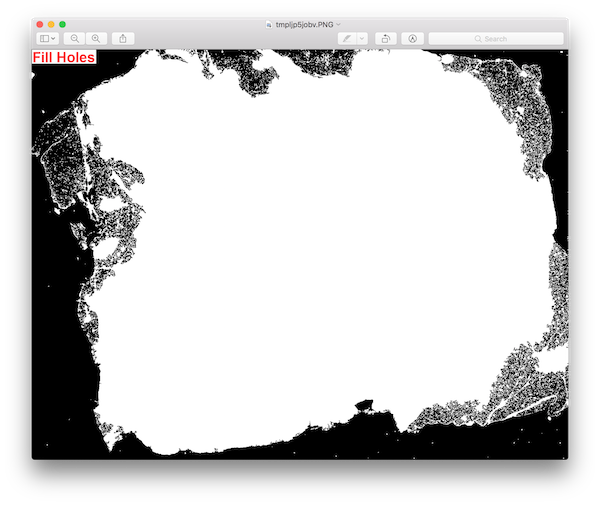 |


In this example, increasing the minimum small hole size results in less differences between "Fill Holes" and
"Remove Small Holes".

| **Differences between Fill Holes and Remove Small Holes (100)** | **Differences between Fill Holes and Remove Small Holes (10000)** |
| -------------------- | --------------------------------- |
| ") | ") |


Console output:

```
RGB                  | Time: 0:00:00.176696  Type: uint8   Shape: (1385, 1810, 3)
Filter Grays         | Time: 0:00:00.082582  Type: bool    Shape: (1385, 1810)
Binary Fill Holes    | Time: 0:00:00.069583  Type: bool    Shape: (1385, 1810)
Remove Small Holes   | Time: 0:00:00.046232  Type: bool    Shape: (1385, 1810)
Remove Small Holes   | Time: 0:00:00.044539  Type: bool    Shape: (1385, 1810)
```


#### Entropy

The scikit-image `entropy()` function allows us to filter images based on complexity. Since areas such as slide
backgrounds are less complex than area of interest such as cell nuclei, filtering on entropy offers interesting
possibilities for tissue identification.

Here, we use the `filter_entropy()` function to filter the grayscale image based on entropy. We display
the resulting binary image. After that, we mask the original image with the entropy mask and the inverse of the entropy
mask.

```
img_path = slide.get_training_image_path(2)
img = slide.open_image(img_path)
rgb = util.pil_to_np_rgb(img)
util.display_img(rgb, "Original")
gray = filter.filter_rgb_to_grayscale(rgb)
util.display_img(gray, "Grayscale")
entropy = filter.filter_entropy(gray, output_type="bool")
util.display_img(entropy, "Entropy")
util.display_img(util.mask_rgb(rgb, entropy), "Original with Entropy Mask")
util.display_img(util.mask_rgb(rgb, ~entropy), "Original with Inverse of Entropy Mask")
```

| **Original Slide** | **Grayscale** |
| -------------------- | --------------------------------- |
|  |  |


| **Entropy Filter** |
| ------------------ |
| 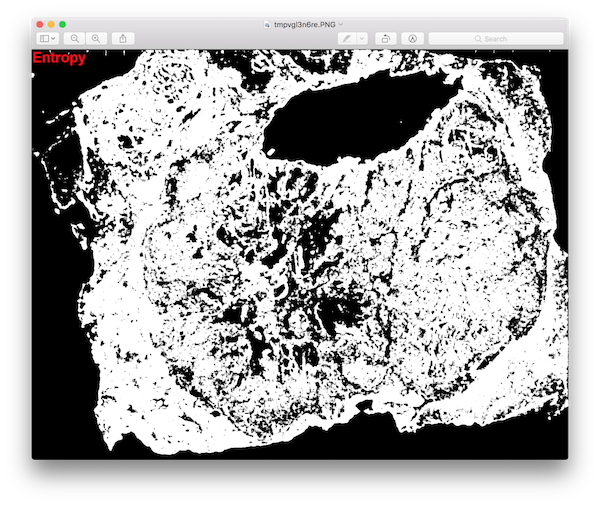 |


The results of the original image with the inverse of the entropy mask are particularly interesting. Notice that much
of the white background including the shadow region at the top of the slide has been filtered out. Additionally, notice
that for the stained regions, a significant amount of the pink eosin-stained area has been filtered out while a
smaller proportion of the purple-stained hemotoxylin area has been filtered out. This makes sense since hemotoxylin
stains regions such as cell nuclei, which are structures with significant complexity. Therefore, entropy seems
like a potential tool that could be used to identify regions of interest where mitoses are occurring.


| **Original with Entropy Mask** | **Original with Inverse of Entropy Mask** |
| -------------------- | --------------------------------- |
| 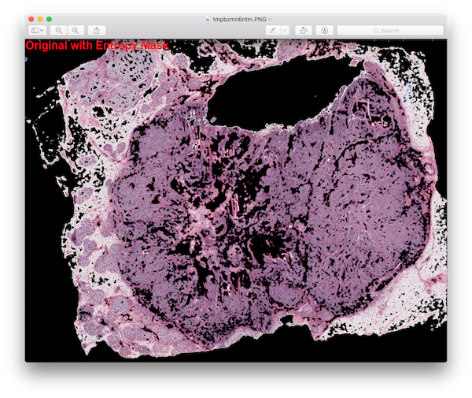 | 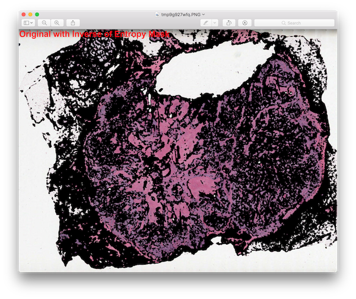 |


A drawback of using entropy is that its computation is significant. The entropy filter takes over 3 seconds to run
in this example.

```
RGB                  | Time: 0:00:00.177166  Type: uint8   Shape: (1385, 1810, 3)
Gray                 | Time: 0:00:00.116245  Type: uint8   Shape: (1385, 1810)
Entropy              | Time: 0:00:03.306786  Type: bool    Shape: (1385, 1810)
Mask RGB             | Time: 0:00:00.010422  Type: uint8   Shape: (1385, 1810, 3)
Mask RGB             | Time: 0:00:00.006140  Type: uint8   Shape: (1385, 1810, 3)
```


#### Canny Edge Detection

Edges in images are areas where there is typically a significant, abrupt change in image brightness.
The Canny edge detection algorithm is implemented in sci-kit image. More information about
edge detection can be found at [https://en.wikipedia.org/wiki/Edge_detection](https://en.wikipedia.org/wiki/Edge_detection).
More information about Canny edge detection can be found at
[https://en.wikipedia.org/wiki/Canny_edge_detector](https://en.wikipedia.org/wiki/Canny_edge_detector).

The sci-kit image `canny()` function returns a binary edge map for the detected edges in an input image. In the
example below, we call `filter_canny()` on the grayscale image and display the resulting Canny edges.
After this, we crop a 600x600 area of the original slide and display it. We apply the inverse of the
canny mask to the cropped original slide area and display it for comparison.

```
img_path = slide.get_training_image_path(2)
img = slide.open_image(img_path)
rgb = util.pil_to_np_rgb(img)
util.display_img(rgb, "Original", bg=True)
gray = filter.filter_rgb_to_grayscale(rgb)
canny = filter.filter_canny(gray, output_type="bool")
util.display_img(canny, "Canny", bg=True)
rgb_crop = rgb[300:900, 300:900]
canny_crop = canny[300:900, 300:900]
util.display_img(rgb_crop, "Original", size=24, bg=True)
util.display_img(util.mask_rgb(rgb_crop, ~canny_crop), "Original with ~Canny Mask", size=24, bg=True)
```

| **Original** | **Canny Edges** |
| -------------------- | --------------------------------- |
|  | 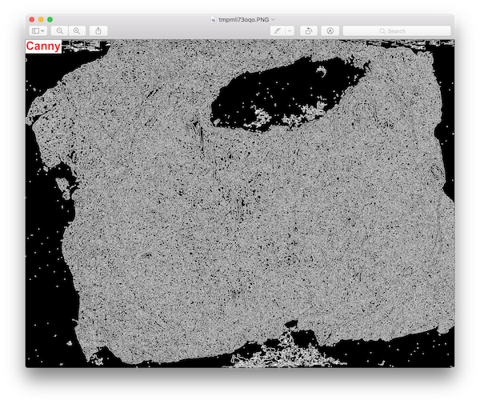 |


By applying the inverse of the canny edge mask to the original image, the detected edges are colored black. This
visually accentuates the different structures in the slide.

| **Cropped Original** | **Cropped Original with Inverse Canny Edges Mask** |
| -------------------- | --------------------------------- |
| 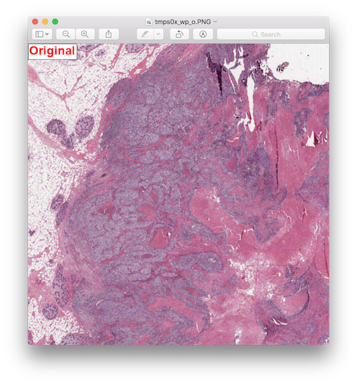 |  |


In the console output, we see that Canny edge detection is fairly expensive, since its computation took over 1 second.

```
RGB                  | Time: 0:00:00.174458  Type: uint8   Shape: (1385, 1810, 3)
Gray                 | Time: 0:00:00.116023  Type: uint8   Shape: (1385, 1810)
Canny Edges          | Time: 0:00:01.017241  Type: bool    Shape: (1385, 1810)
Mask RGB             | Time: 0:00:00.001443  Type: uint8   Shape: (600, 600, 3)
```


### Combining Filters

Since our image filters utilize NumPy arrays, it is straightforward to combine our filters. For example, when
we have filters that return boolean images for masking, we can use standard boolean algebra on our arrays to perform
operations such as AND, OR, XOR, and NOT. We can also run filters on the results of other filters.

As an example, here we run our green pen and blue pen filters on the original RGB image to filter out the green and
blue pen marks on the slide. We combine the resulting masks with a boolean AND (&) operation. We display the resulting
mask and this mask applied to the original image, masking out the green and blue pen marks from the image.

```
img_path = slide.get_training_image_path(74)
img = slide.open_image(img_path)
rgb = util.pil_to_np_rgb(img)
util.display_img(rgb, "Original")
no_green_pen = filter.filter_green_pen(rgb)
util.display_img(no_green_pen, "No Green Pen")
no_blue_pen = filter.filter_blue_pen(rgb)
util.display_img(no_blue_pen, "No Blue Pen")
no_gp_bp = no_green_pen & no_blue_pen
util.display_img(no_gp_bp, "No Green Pen, No Blue Pen")
util.display_img(util.mask_rgb(rgb, no_gp_bp), "Original with No Green Pen, No Blue Pen")
```

| **Original Slide** |
| -------------------- |
|  |

| **No Green Pen** | **No Blue Pen** |
| -------------------- | --------------------------------- |
| 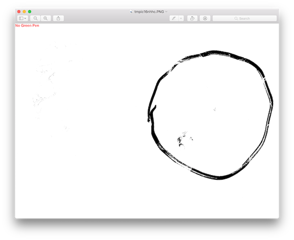 | 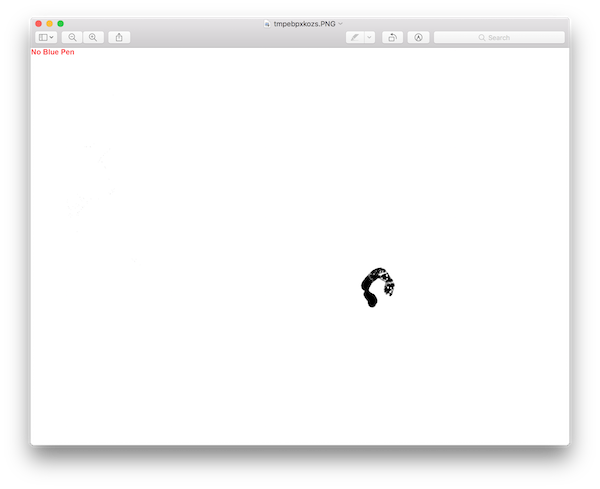 |

| **No Green Pen, No Blue Pen** | **Original with No Green Pen, No Blue Pen** |
| -------------------- | --------------------------------- |
| 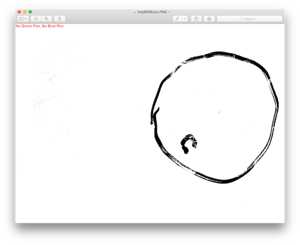 | 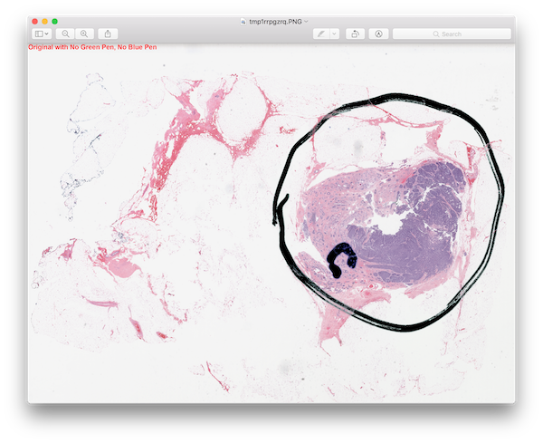 |


Console Output:

```
RGB                  | Time: 0:00:00.525283  Type: uint8   Shape: (2592, 3509, 3)
Filter Green Pen     | Time: 0:00:00.562343  Type: bool    Shape: (2592, 3509)
Filter Blue Pen      | Time: 0:00:00.414910  Type: bool    Shape: (2592, 3509)
Mask RGB             | Time: 0:00:00.054763  Type: uint8   Shape: (2592, 3509, 3)
```


---

Let's try another combination of filters that should give us fairly good tissue segmentation for this slide,
where the slide background and blue and green pen marks are removed. We can do this for this slide by ANDing
together the "No Grays" filter, the "Green Channel" filter, the "No Green Pen" filter, and the "No Blue Pen" filter.
In addition, we can use our "Remove Small Objects" filter to remove small islands from the mask. We display the
resulting mask. We apply this mask and the inverse of the mask to the original image to visually see which parts of the
slide are passed through and which parts are masked out.

```
img_path = slide.get_training_image_path(74)
img = slide.open_image(img_path)
rgb = util.pil_to_np_rgb(img)
util.display_img(rgb, "Original")
mask = filter.filter_grays(rgb) & filter.filter_green_channel(rgb) & filter.filter_green_pen(rgb) & filter.filter_blue_pen(rgb)
mask = filter.filter_remove_small_objects(mask, min_size=100, output_type="bool")
util.display_img(mask, "No Grays, Green Channel, No Green Pen, No Blue Pen, No Small Objects")
util.display_img(util.mask_rgb(rgb, mask), "Original with No Grays, Green Channel, No Green Pen, No Blue Pen, No Small Objects")
util.display_img(util.mask_rgb(rgb, ~mask), "Original with Inverse Mask")
```

| **Original Slide** | **No Grays, Green Channel, No Green Pen, No Blue Pen, No Small Objects** |
| -------------------- | --------------------------------- |
| 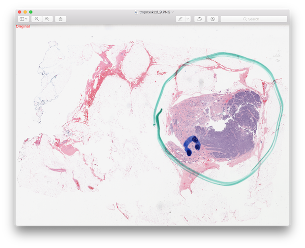 |  |


We see that this combination does a good job at allowing us to filter the most relevant tissue sections of this slide.

| **Original with No Grays, Green Channel, No Green Pen, No Blue Pen, No Small Objects** | **Original with Inverse Mask** |
| -------------------- | --------------------------------- |
| 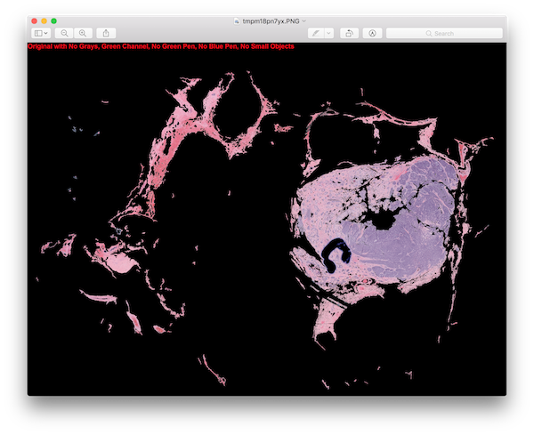 |  |


Console Output:

```
RGB                  | Time: 0:00:00.496920  Type: uint8   Shape: (2592, 3509, 3)
Filter Grays         | Time: 0:00:00.361576  Type: bool    Shape: (2592, 3509)
Filter Green Channel | Time: 0:00:00.020190  Type: bool    Shape: (2592, 3509)
Filter Green Pen     | Time: 0:00:00.488955  Type: bool    Shape: (2592, 3509)
Filter Blue Pen      | Time: 0:00:00.369501  Type: bool    Shape: (2592, 3509)
Remove Small Objs    | Time: 0:00:00.178179  Type: bool    Shape: (2592, 3509)
Mask RGB             | Time: 0:00:00.047400  Type: uint8   Shape: (2592, 3509, 3)
Mask RGB             | Time: 0:00:00.048710  Type: uint8   Shape: (2592, 3509, 3)
```


---

In the `wsi/filter.py` file, the `apply_filters_to_image(slide_num, save=True, display=False)` function is the
primary way we apply a set of filters to an image with the goal of identifying the tissue in the slide. This
function allows us to see the results of each filter and the combined results of different filters. If the
`save` parameter is `True`, the various filter results will be saved to the file system. If the `display`
parameter is `True`, the filter results will be displayed on the screen. The function returns a tuple consisting of
the resulting NumPy array image and a dictionary of information that is used elsewhere for generating an HTML page
to view the various filter results for multiple slides, as we will see later.

The `apply_filters_to_image()` function calls the `apply_image_filters()` function, which creates green channel, grays,
red pen, green pen, and blue pen masks and combines these into a single mask using boolean ANDs.
After this, small objects are removed from the mask.

```
mask_not_green = filter_green_channel(rgb)
mask_not_gray = filter_grays(rgb)
mask_no_red_pen = filter_red_pen(rgb)
mask_no_green_pen = filter_green_pen(rgb)
mask_no_blue_pen = filter_blue_pen(rgb)
mask_gray_green_pens = mask_not_gray & mask_not_green & mask_no_red_pen & mask_no_green_pen & mask_no_blue_pen
mask_remove_small = filter_remove_small_objects(mask_gray_green_pens, min_size=500, output_type="bool")
```

After each of the above masks is created, it is applied to the original image and the resulting image is saved
to the file system, displayed to the screen, or both.

Let's try this function out. In this example, we run `apply_filters_to_image()` on slide #337 and display the results
to the screen.

```
filter.apply_filters_to_image(337, display=True, save=False)
```

Note that this function utilizes the scaled-down `png` image for slide #337. If we have not generated `png` images for
all the slides (typically by calling `slide.multiprocess_training_slides_to_images()`), we can generate the individual
scaled-down `png` image and then apply the filters to this image.

```
slide.training_slide_to_image(337)
filter.apply_filters_to_image(337, display=True, save=False)
```

Here, we see the original slide #337 and the green channel filter applied to it. The original slide is marked as 0.12%
masked because a small number of pixels in the original image are black (0 values for the red, green, and blue
channels). Notice that the green channel filter
with a default threshold of 200 removes most of the white background but only a relatively small fraction of the green
pen. The green channel filter masks 72.60% of the original slide.

| **Slide 337, F001** | **Slide 337, F002** |
| -------------------- | --------------------------------- |
|  | 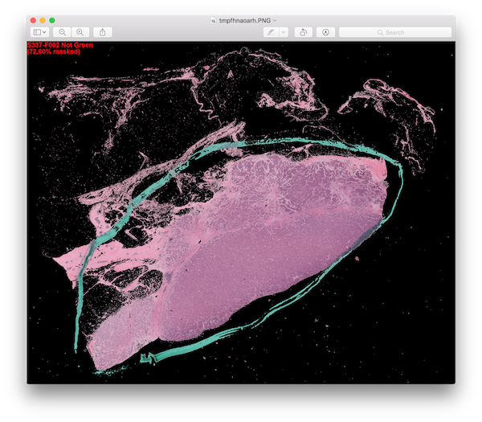 |


Here, we see the results of the grays filter and the red pen filter. For this slide, the grays filter masks 68.01% of
the slide, which is actually less than the green channel filter. The red pen filter masks only 0.18% of the slide,
which makes sense since there are no red pen marks on the slide.

| **Slide 337, F003** | **Slide 337, F004** |
| -------------------- | --------------------------------- |
| 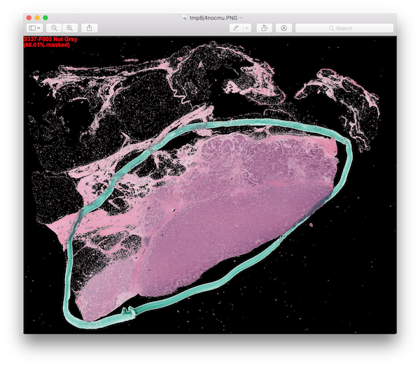 |  |


The green pen filter masks 3.81% of the slide. Visually, we see that it does a decent job of masking out the green
pen marks on the slide. The blue pen filter masks 0.12% of the slide, which is accurate since there are no blue pen
marks on the slide.

| **Slide 337, F005** | **Slide 337, F006** |
| -------------------- | --------------------------------- |
| 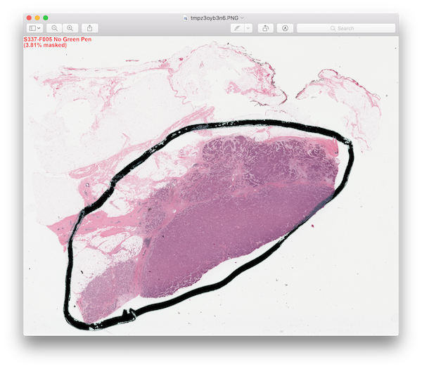 | 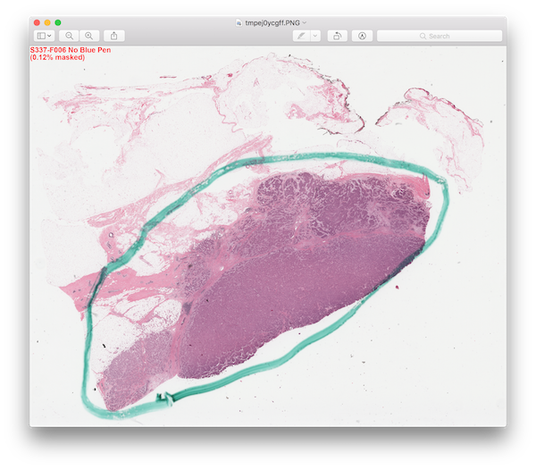 |


Combining the above filters with a boolean AND results in 74.57% masking. Cleaning up these results by remove small
objects results in a masking of 76.11%. This potentially gives a good tissue segmentation that we can use for deep
learning.

| **Slide 337, F007** | **Slide 337, F008** |
| -------------------- | --------------------------------- |
| 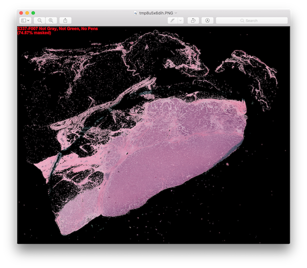 | 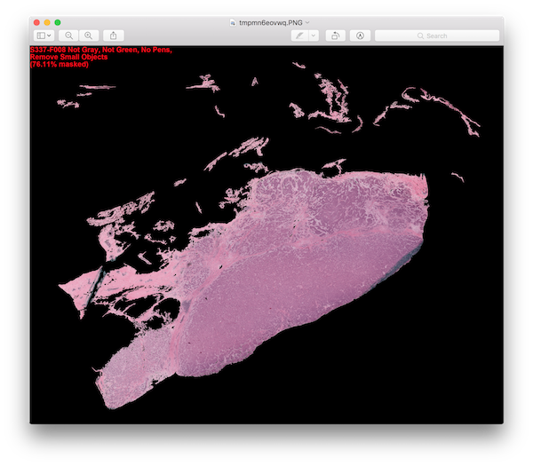 |


In the console, we see the slide #337 processing time takes ~12.6s in this example. The filtering is only a relatively
small fraction of this time. If we set `display` to `False`, processing only takes ~2.3s.

```
Processing slide #337
RGB                  | Time: 0:00:00.568235  Type: uint8   Shape: (2515, 3149, 3)
Filter Green Channel | Time: 0:00:00.017670  Type: bool    Shape: (2515, 3149)
Mask RGB             | Time: 0:00:00.037547  Type: uint8   Shape: (2515, 3149, 3)
Filter Grays         | Time: 0:00:00.323861  Type: bool    Shape: (2515, 3149)
Mask RGB             | Time: 0:00:00.032874  Type: uint8   Shape: (2515, 3149, 3)
Filter Red Pen       | Time: 0:00:00.253547  Type: bool    Shape: (2515, 3149)
Mask RGB             | Time: 0:00:00.035073  Type: uint8   Shape: (2515, 3149, 3)
Filter Green Pen     | Time: 0:00:00.395172  Type: bool    Shape: (2515, 3149)
Mask RGB             | Time: 0:00:00.032597  Type: uint8   Shape: (2515, 3149, 3)
Filter Blue Pen      | Time: 0:00:00.314914  Type: bool    Shape: (2515, 3149)
Mask RGB             | Time: 0:00:00.034853  Type: uint8   Shape: (2515, 3149, 3)
Mask RGB             | Time: 0:00:00.034556  Type: uint8   Shape: (2515, 3149, 3)
Remove Small Objs    | Time: 0:00:00.160241  Type: bool    Shape: (2515, 3149)
Mask RGB             | Time: 0:00:00.030854  Type: uint8   Shape: (2515, 3149, 3)
Slide #337 processing time: 0:00:12.576835
```

Since `apply_filters_to_image()` returns the resulting image as a NumPy array, we can perform further processing on
the image. If we look at the `apply_filters_to_image()` results for slide #337, we can see that some grayish greenish
pen marks remain on the slide. We can filter some of these out using our `filter_green()` function with different
threshold values and our `filter_grays()` function with an increased tolerance value.

We'll compare the results by cropping two regions of the slide before and after this additional processing and
displaying all four of these regions together.

```
rgb, _ = filter.apply_filters_to_image(337, display=False, save=False)

not_greenish = filter.filter_green(rgb, red_upper_thresh=125, green_lower_thresh=30, blue_lower_thresh=30, display_np_info=True)
not_grayish = filter.filter_grays(rgb, tolerance=30)
rgb_new = util.mask_rgb(rgb, not_greenish & not_grayish)

row1 = np.concatenate((rgb[1200:1800, 150:750], rgb[1150:1750, 2050:2650]), axis=1)
row2 = np.concatenate((rgb_new[1200:1800, 150:750], rgb_new[1150:1750, 2050:2650]), axis=1)
result = np.concatenate((row1, row2), axis=0)
util.display_img(result)
```

After the additional processing, we see that the pen marks in the displayed regions have been significantly reduced.

| **Remove More Green and More Gray** |
| -------------------- |
|  |


As another example, here we can see a summary of filters applied to a slide by `apply_filters_to_image()` and the
resulting masked image.

| **Filter Example** |
| ------------------ |
| 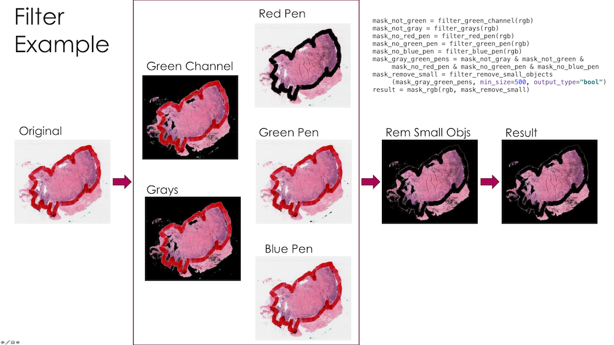 |


### Applying Filters to Multiple Images

When designing our set of tissue-selecting filters, one very important requirement is the ability to visually inspect
the filter results across multiple slides. Ideally we should easily be able to alternate between displaying the
results for a single image, a select subset of our training image dataset, and our entire dataset. Additionally,
multiprocessing can result in a significant performance boost, so we should be able to multiprocess our image
processing if desired.

A simple, powerful way to visually inspect our filter results is to generate an HTML page for a set of images.

The following functions in `wsi/filter.py` can be used to apply filters to multiple images:

```
apply_filters_to_image_list(image_num_list, save, display)
apply_filters_to_image_range(start_ind, end_ind, save, display)
singleprocess_apply_filters_to_images(save=True, display=False, html=True, image_num_list=None)
multiprocess_apply_filters_to_images(save=True, display=False, html=True, image_num_list=None)

```

The `apply_filters_to_image_list()` function takes a list of image numbers for processing. It does not generate an
HTML page but it does generate information that can be used by other functions to generate an HTML page.
The `save` parameter if `True` will save the generated images to the file system. If the `display` parameter
is `True`, the generated images will be displayed to the screen. If several slides are being processed,
`display` should be set to False.

The `apply_filters_to_image_range()` function is similar to `apply_filters_to_image_list()` except than rather than
taking a list of image numbers, it takes a starting index number and ending index number for the slides in the
training set. Like `apply_filters_to_image_list()`, the `apply_filters_to_image_range()` function has `save` and
`display` parameters.

The `singleprocess_apply_filters_to_images()` and `multiprocess_apply_filters_to_images()` functions are the
primary functions that should be called to apply filters to multiple images. Both of these functions feature `save`
and `display` parameters. The additional `html` parameter if `True` generates an HTML page for displaying the filter
results on the image set. The `singleprocess_apply_filters_to_images()` and `multiprocess_apply_filters_to_images()`
functions also feature an `image_num_list` parameter which specifies a list of image numbers that should be
processed. If `image_num_list` is not supplied, all training images are processed.

As an example, let's use a single process to apply our filters to images 1, 2, and 3. We can accomplish this with
the following:

```
filter.singleprocess_apply_filters_to_images(image_num_list=[1, 2, 3])
```

In addition to saving the filtered images to the file system, this creates a `filters.html` file that displays all the
filtered slide images.
If we open the `filters.html` file in a browser, we can see 8 images displayed for each slide. Each separate slide
is displayed as a separate row. Here, we see the filter results for slides #1, #2, and #3 displayed in a browser.

| **Filters for Slides 1, 2, 3** |
| -------------------- |
| 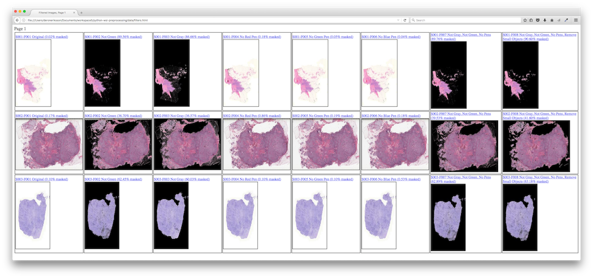 |


To apply all filters to all images in the training set using multiprocessing, we can utilize the
`multiprocess_apply_filters_to_images()` function. Since there are 9 generated images per slide
(8 of which are shown in the HTML summary) and 500 slides, this results in a total of 4,500 images
and 4,500 thumbnails. Generating `png` images and `jpg` thumbnails, this takes about 24 minutes on
my MacBook Pro.

```
filter.multiprocess_apply_filters_to_images()
```

If we display the `filters.html` file in a browser, we see that the filter results for the first 50 slides are
displayed. By default, results are paginated at 50 slides per page. Pagination can be turned on and off using the
`FILTER_PAGINATE` constant. The pagination size can be adjusted using the `FILTER_PAGINATION_SIZE` constant.

One useful action we can take is to group similar slides into categories. For example,
we can group slides into sets that have red, green, and blue pen marks on them.

```
red_pen_slides = [4, 15, 24, 48, 63, 67, 115, 117, 122, 130, 135, 165, 166, 185, 209, 237, 245, 249, 279, 281, 282, 289, 336, 349, 357, 380, 450, 482]
green_pen_slides = [51, 74, 84, 86, 125, 180, 200, 337, 359, 360, 375, 382, 431]
blue_pen_slides = [7, 28, 74, 107, 130, 140, 157, 174, 200, 221, 241, 318, 340, 355, 394, 410, 414, 457, 499]
```

We can run our filters on the list of red pen slides in the following manner:

```
filter.multiprocess_apply_filters_to_images(image_num_list=red_pen_slides)
```

In this way, we can make tweaks to specific filters or combinations of specific filters and see how these changes apply
to the subset of relevant training images without requiring reprocessing of the entire training dataset.

| **Red Pen Slides with Filter Results** |
| -------------------- |
|  |


### Overmask Avoidance

When developing filters and filter settings to perform tissue segmentation on the entire training
set, we have to deal with a great amount of variation in the slide samples. To begin with, some slides have a large
amount of tissue on them, while other slides only have a minimal amount of tissue. There is a great deal of
variation in tissue staining. We also need to deal with additional issues such as pen marks and shadows on some of
the slides.

Slide #498 is an example of a slide with a large tissue sample. After filtering, the slide is 46% masked.

| **Slide with Large Tissue Sample** | **Slide with Large Tissue Sample after Filtering** |
| -- | -- |
| 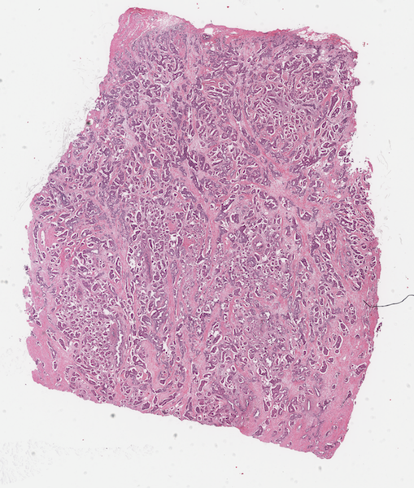 | 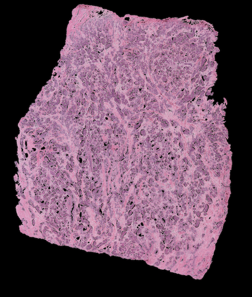 |


Slide #127 is an example of a small tissue sample. After filtering, the slide is 93% masked. With such a small tissue
sample to begin with, we need to be careful that our filters don't overmask this slide.

| **Slide with Small Tissue Sample** | **Slide with Small Tissue Sample after Filtering** |
| -- | -- |
|  |  |


Being aggressive in our filtering may generate excellent results for many of the slides but may
result in overmasking of other slides, where the amount of non-tissue masking is too high. For example, if 99% of
a slide is masked, it has been overmasked.

Avoiding overmasking across the entire training dataset can be difficult. For example, suppose we have a slide that
has only a proportionaly small amount of tissue on it to start, say 10%. If this particular tissue sample has been
poorly stained so that it is perhaps a light purplish grayish color, applying our grays or green channel filters might
result in a significant portion of the tissue being masked out. This could also potentially result in small
islands of non-masked tissue, and since we utilize a filter to remove small objects, this could result in the
further masking out of additional tissue regions. In such a situation, masking of 95% to 100% of the slide is possible.

Slide #424 has a small tissue sample and its staining is a very faint lavender color. Slide #424 is
at risk for overmasking with our given combination of filters.

| **Slide with Small Tissue Sample and Faint Staining** |
| -- |
| 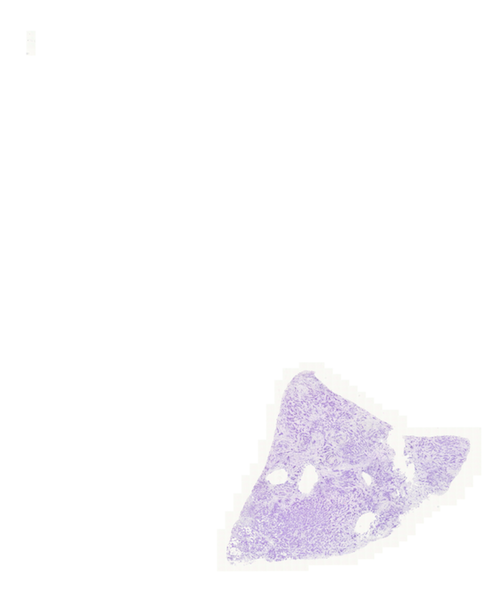 |


Therefore, rather than having fixed settings, we can automatically have our filters tweak parameter values to avoid
overmasking if desired. As examples, the `filter_green_channel()` and `filter_remove_small_objects()` functions have
this ability. If masking exceeds a certain overmasking threshold, a parameter value can be changed to lower
the amount of masking until the masking is below the overmasking threshold.

```
filter.filter_green_channel(np_img, green_thresh=200, avoid_overmask=True, overmask_thresh=90, output_type="bool")
filter.filter_remove_small_objects(np_img, min_size=3000, avoid_overmask=True, overmask_thresh=95, output_type="uint8")
```

For the `filter_green_channel()` function, if a `green_thresh` value of 200 results in masking over 90%, the
function will try with a higher `green_thresh` value (228) and the masking level will be checked. This will continue
until the masking doesn't exceed the overmask threshold of 90% or the threshold is 255.

For the `filter_remove_small_objects()` function, if a `min_size` value of 3000 results in a masking level over 95%,
the function will try with a lower `min_size` value (1500) and the masking level will be checked. These `min_size`
reductions will continue until the masking level isn't over 95% or the minimum size is 0. For the image filtering
specified in `apply_image_filters`, a starting `min_size` value of 500 for `filter_remove_small_objects()` is used.

Examining our full set of images using `multiprocess_apply_filters_to_images()`, we can identify slides that are
at risk for overmasking. We can create a list of these slide numbers and use `multiprocess_apply_filters_to_images()`
with this list of slide numbers to generate the `filters.html` page that allows us to visually inspect the filters
applied to this set of slides.

```
overmasked_slides = [1, 21, 29, 37, 43, 88, 116, 126, 127, 142, 145, 173, 196, 220, 225, 234, 238, 284, 292, 294, 304,
                     316, 401, 403, 424, 448, 452, 472, 494]
filter.multiprocess_apply_filters_to_images(image_num_list=overmasked_slides)
```

Let's have a look at how we reduce overmasking on slide 21, which is a slide that has very faint staining.

| **Slide 21** |
| -------------------- |
|  |


We'll run our filters on slide #21.

```
filter.singleprocess_apply_filters_to_images(image_num_list=[21])
```

If we set the `filter_green_channel()` and `filter_remove_small_objects()` `avoid_overmask` parameters to False,
97.69% of the original image is masked by the "green channel" filter and 99.92% of the original image is
masked by the subsequent "remove small objects" filter. This is significant overmasking.

| **Overmasked by Green Channel Filter (97.69%)** | **Overmasked by Remove Small Objects Filter (99.92%)** |
| -- | -- |
| ") | ")

If we set `avoid_overmask` to True for `filter_remove_small_objects()`, we see that the "remove small objects"
filter does not perform any further masking since the 97.69% masking from the previous "green channel" filter
already exceeds its overmasking threshold of 95%.

| **Overmasked by Green Channel Filter (97.69%)** | **Avoid Overmask by Remove Small Objects Filter (97.69%)** |
| -- | -- |
| ") | ")


If we set `avoid_overmask` back to False for `filter_remove_small_objects()` and we set `avoid_overmask` to True for
`filter_green_channel()`, we see that 87.91% of the original image is masked by the "green channel" filter (under
the 90% overmasking threshold for the filter) and 97.40% of the image is masked by the subsequent
"remove small objects" filter.

| **Avoid Overmask by Green Channel Filter (87.91%)** | **Overmask by Remove Small Objects Filter (97.40%)** |
| -- | -- |
| ") | ")


If we set `avoid_overmask` to True for both `filter_green_channel()` and `filter_remove_small_objects()`, we see that
the resulting masking after the "remove small objects" filter has been reduced to 94.88%, which is under its
overmasking threshold of 95%.

| **Avoid Overmask by Green Channel Filter (87.91%)** | **Avoid Overmask by Remove Small Objects Filter (94.88%)** |
| -- | -- |
| ") | ")


Thus, in this example we've reduced the masking from 99.92% to 94.88%.

We can see the filter adjustments being made in the console output.

```
Processing slide #21
RGB                  | Time: 0:00:00.095414  Type: uint8   Shape: (1496, 1576, 3)
Save Image           | Time: 0:00:00.617039  Name: ../data/filter_png/TUPAC-TR-021-001-rgb.png
Save Thumbnail       | Time: 0:00:00.019557  Name: ../data/filter_thumbnail_jpg/TUPAC-TR-021-001-rgb.jpg
Mask percentage 97.69% >= overmask threshold 90.00% for Remove Green Channel green_thresh=200, so try 228
Filter Green Channel | Time: 0:00:00.005335  Type: bool    Shape: (1496, 1576)
Filter Green Channel | Time: 0:00:00.010499  Type: bool    Shape: (1496, 1576)
Mask RGB             | Time: 0:00:00.009980  Type: uint8   Shape: (1496, 1576, 3)
Save Image           | Time: 0:00:00.322629  Name: ../data/filter_png/TUPAC-TR-021-002-rgb-not-green.png
Save Thumbnail       | Time: 0:00:00.018244  Name: ../data/filter_thumbnail_jpg/TUPAC-TR-021-002-rgb-not-green.jpg
Filter Grays         | Time: 0:00:00.072200  Type: bool    Shape: (1496, 1576)
Mask RGB             | Time: 0:00:00.010461  Type: uint8   Shape: (1496, 1576, 3)
Save Image           | Time: 0:00:00.295995  Name: ../data/filter_png/TUPAC-TR-021-003-rgb-not-gray.png
Save Thumbnail       | Time: 0:00:00.017668  Name: ../data/filter_thumbnail_jpg/TUPAC-TR-021-003-rgb-not-gray.jpg
Filter Red Pen       | Time: 0:00:00.055296  Type: bool    Shape: (1496, 1576)
Mask RGB             | Time: 0:00:00.008704  Type: uint8   Shape: (1496, 1576, 3)
Save Image           | Time: 0:00:00.595753  Name: ../data/filter_png/TUPAC-TR-021-004-rgb-no-red-pen.png
Save Thumbnail       | Time: 0:00:00.016758  Name: ../data/filter_thumbnail_jpg/TUPAC-TR-021-004-rgb-no-red-pen.jpg
Filter Green Pen     | Time: 0:00:00.088633  Type: bool    Shape: (1496, 1576)
Mask RGB             | Time: 0:00:00.008860  Type: uint8   Shape: (1496, 1576, 3)
Save Image           | Time: 0:00:00.585474  Name: ../data/filter_png/TUPAC-TR-021-005-rgb-no-green-pen.png
Save Thumbnail       | Time: 0:00:00.016964  Name: ../data/filter_thumbnail_jpg/TUPAC-TR-021-005-rgb-no-green-pen.jpg
Filter Blue Pen      | Time: 0:00:00.069669  Type: bool    Shape: (1496, 1576)
Mask RGB             | Time: 0:00:00.009665  Type: uint8   Shape: (1496, 1576, 3)
Save Image           | Time: 0:00:00.589634  Name: ../data/filter_png/TUPAC-TR-021-006-rgb-no-blue-pen.png
Save Thumbnail       | Time: 0:00:00.016736  Name: ../data/filter_thumbnail_jpg/TUPAC-TR-021-006-rgb-no-blue-pen.jpg
Mask RGB             | Time: 0:00:00.009115  Type: uint8   Shape: (1496, 1576, 3)
Save Image           | Time: 0:00:00.294103  Name: ../data/filter_png/TUPAC-TR-021-007-rgb-no-gray-no-green-no-pens.png
Save Thumbnail       | Time: 0:00:00.017540  Name: ../data/filter_thumbnail_jpg/TUPAC-TR-021-007-rgb-no-gray-no-green-no-pens.jpg
Mask percentage 97.40% >= overmask threshold 95.00% for Remove Small Objs size 500, so try 250
Mask percentage 96.83% >= overmask threshold 95.00% for Remove Small Objs size 250, so try 125
Mask percentage 95.87% >= overmask threshold 95.00% for Remove Small Objs size 125, so try 62
Remove Small Objs    | Time: 0:00:00.031198  Type: bool    Shape: (1496, 1576)
Remove Small Objs    | Time: 0:00:00.062300  Type: bool    Shape: (1496, 1576)
Remove Small Objs    | Time: 0:00:00.095616  Type: bool    Shape: (1496, 1576)
Remove Small Objs    | Time: 0:00:00.128008  Type: bool    Shape: (1496, 1576)
Mask RGB             | Time: 0:00:00.007214  Type: uint8   Shape: (1496, 1576, 3)
Save Image           | Time: 0:00:00.235025  Name: ../data/filter_png/TUPAC-TR-021-008-rgb-not-green-not-gray-no-pens-remove-small.png
Save Thumbnail       | Time: 0:00:00.016905  Name: ../data/filter_thumbnail_jpg/TUPAC-TR-021-008-rgb-not-green-not-gray-no-pens-remove-small.jpg
Save Image           | Time: 0:00:00.232206  Name: ../data/filter_png/TUPAC-TR-021-32x-50432x47872-1576x1496-filtered.png
Save Thumbnail       | Time: 0:00:00.017285  Name: ../data/filter_thumbnail_jpg/TUPAC-TR-021-32x-50432x47872-1576x1496-filtered.jpg
Slide #021 processing time: 0:00:04.596086

```


## Tiles

Following our filtering, we should have fairly good tissue segmentation for our dataset,
where non-tissue pixels have been masked out from our 1/32x scaled-down slide images. At this
stage, we break our images into tile regions. Tiling code is located in the `wsi/tiles.py`
file.

For visualization, the tissue percentage of each tile is color-coded in a similar fashion
to a heat map. Tiles with 80% or more tissue are green, tiles less than 80% tissue and greater
or equal to 10% tissue are yellow, tiles less than 10% tissue and greater than 0% tissue are
orange, and tiles with 0% tissue are red.

The heat map threshold values can be adjusted by modifying the `TISSUE_HIGH_THRESH` and
`TISSUE_LOW_THRESH` constants in `wsi/tiles.py`, which have default values of 80 and 10
respectively. Heat map colors can be adjusted by modifying the `HIGH_COLOR`, `MEDIUM_COLOR`,
`LOW_COLOR`, and `NONE_COLOR` constants. The heat map border size can be adjusted using the
`TILE_BORDER_SIZE` constant, which has a default value of 2.
Tile sizes are specified according to number of pixels in the original WSI files. The
default `ROW_TILE_SIZE` and `COL_TILE_SIZE` values are 1,024 pixels.

To generate and display tiles for a single slide, we utilize the `summary_and_tiles()` function,
which generates tile summaries and returns the top scoring tiles for a slide. We discuss
tile scoring in a later section.

Let's generate tile tissue heat map summaries for slide #2 and display the summaries to the screen.

```
tiles.summary_and_tiles(2, display=True, save_summary=True, save_data=False, save_top_tiles=False)
```

Here, we see the tile tissue segmentation heat map summaries that are generated. The heat maps are
displayed on the masked image and the original image to allow for comparison.

| **Tissue Heat Map** | **Tissue Heat Map on Original** |
| ------------------------ | ------------------------------------ |
|  | 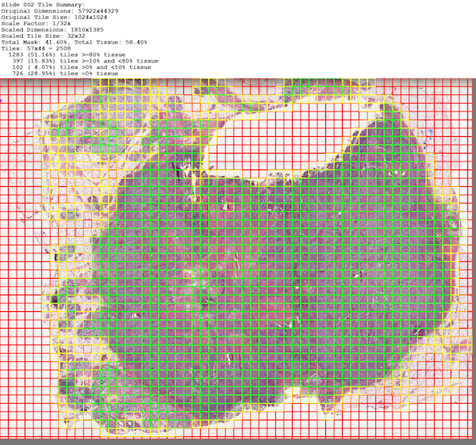 |

We see a variety of slide statistics displayed on the tile summaries. We see that slide #2
has dimensions of 57,922x44,329. After scaling down the slide width and height by 1/32x, we have a
`png` image with dimensions 1,810x1,385. Breaking this image down into 32x32 tiles, we have 57 rows
and 44 columns, making a total of 2,508 tiles. Using our tissue segmentation filtering algorithms,
we have 1,283 tiles with high tissue percentages (>=80%), 397 tiles with medium tissue percentages
(>=10% and <80%), 102 tiles with low tissue percentages (>0% and <10%), and 726 tiles with no tissue
(0%).

| Characteristic      | Result        |
| ------------------- | ------------- |
| Original Dimensions | 57,922x44,329 |
| Original Tile Size  | 1,024x1,024   |
| Scale Factor        | 1/32x         |
| Scaled Dimensions   | 1,810x1,385   |
| Scaled Tile Size    | 32x32         |
| Total Mask          | 41.60%        |
| Total Tissue        | 58.40%        |
| Tiles               | 57x44 = 2,508  |
| | 1,283 (51.16%) tiles >=80% tissue          |
| |   397 (15.83%) tiles >=10% and <80% tissue |
| |   102 ( 4.07%) tiles >0% and <10% tissue   |
| |   726 (28.95%) tiles =0% tissue            |


Often it can be useful to know the exact row and column of a particular tile or tiles. If the
`DISPLAY_TILE_SUMMARY_LABELS` constant is set to True, the row and column of each tile is
output on the tile summaries. Generating the tile labels is fairly time-consuming, so usually
`DISPLAY_TILE_SUMMARY_LABELS` should be set to False for performance.

| **Optional Tile Labels** |
| -------------------- |
|  |


## Tile Scoring

In order to selectively choose how "good" a tile is compared to other tiles, we assign scores to
tiles based on tissue percentage and color characteristics. To determine the "best" tiles, we
sort based on score and return the top scoring tiles. We generate top tile summaries based on the
top scoring tiles, in a similar fashion as the tissue percentage summaries.

The `score_tile()` function assigns a score to a tile based on the tissue percentage and various
color characteristics of the tile. The scoring formula utilized by `score_tile()` can be summarized
as follows.

| **Scoring Formula** |
| -------------------- |
|  |

The scoring formula generates good results for the images in the dataset and was developed through
experimentation with the training dataset. The *tissuepercent* is emphasized by squaring its value.
The *colorfactor* value is used to weigh hematoxylin staining heavier than eosin staining. Utilizing
the HSV color model, broad saturation and value distributions are given more weight by the
*saturationvaluefactor*. The *quantityfactor* value utilizes the tissue percentage to give more weight
to tiles with more tissue. Note that if *colorfactor*, *saturationvaluefactor*, or
*quantityfactor* evaluate to 0, the *score* will be 0. The *score* is scaled to a value from
0.0 to 1.0.

During our discussion of color staining, we mentioned that tissue with hematoxylin staining is most
likely preferable to eosin staining. Hematoxylin stains acidic structures such as DNA and RNA with
a purple tone, while eosin stains basic structures such as cytoplasm proteins with a pink tone.
Let's discuss how we can more heavily score tiles with hematoxylin staining over eosin staining.

Differentiating purplish shades from pinkish shades can be difficult using the RGB color space
(see [https://en.wikipedia.org/wiki/RGB_color_space](https://en.wikipedia.org/wiki/RGB_color_space)).
Therefore, to compute our *colorfactor* value, we first convert our tile in RGB color space
to HSV color space (see [https://en.wikipedia.org/wiki/HSL_and_HSV](https://en.wikipedia.org/wiki/HSL_and_HSV)).
HSV stands for Hue-Saturation-Value. In this color model, the hue is represented as a degree value
on a circle. Purple has a hue of 270 degrees and pink has a hue of 330
degrees. We remove all hues less than 260 and greater than 340. Next, we compute the deviation from
purple (270) and the deviation from pink (330). We compute an average factor which is the squared
difference of 340 and the hue average. The *colorfactor* is computed as the pink deviation times
the average factor divided by the purple deviation.

Let's have a closer look at a 32x32 tile and its accompanying HSV hue histogram. Note that in order
to properly convert a matplotlib chart image (the histogram) to a NumPy image on macOS, we currently
need to include a call to `matplotlib.use('Agg')`.
One way we can obtain a particular tile for analysis is to call
the `dynamic_tile()` function, which we describe in more detail later. Here, we obtain
the tile at the 29th row and 16th column on slide #2. Setting the `small_tile_in_tile` parameter
to `True` means that the scaled-down 32x32 tile is included in the returned Tile object.
The `display_image_with_hsv_hue_histogram()` function is used to display the small tile and its hue
histogram.

```
# To get around renderer issue on macOS going from Matplotlib image to NumPy image.
import matplotlib
matplotlib.use('Agg')
from deephistopath.wsi import tiles

tile = tiles.dynamic_tile(2, 29, 16, True)
tiles.display_image_with_hsv_hue_histogram(tile.get_np_scaled_tile(), scale_up=True)
```

Here we see the 32x32 slide with its accompanying hue histogram. For convenience, colors have
been added to the histogram.
Also, notice that the non-tissue masked-out pixels have a peak at 0 degrees.

| **Tile HSV Hue Histogram** |
| -------------------- |
|  |


For convenience, the `Tile` class has a `display_with_histograms()` function that can be used
to display histograms for both the RGB and HSV color spaces. If the scaled-down small tile is
included in the Tile object (using the `dynamic_tile()` `small_tile_in_tile` parameter with a
value of `True`), histograms will be displayed for both the small tile and the large tile.

```
import matplotlib
matplotlib.use('Agg')
from deephistopath.wsi import tiles

tile = tiles.dynamic_tile(2, 29, 16, True)
tile.display_with_histograms();
```

Here we see RGB and HSV histograms for the scaled-down tile at slide 2, row 29, column 16. We
see its score and tissue percentage. This tile's score was ranked 734 out of
a total of 2,508 tiles on this slide.

| **Small Tile Color Histograms** |
| -------------------- |
| 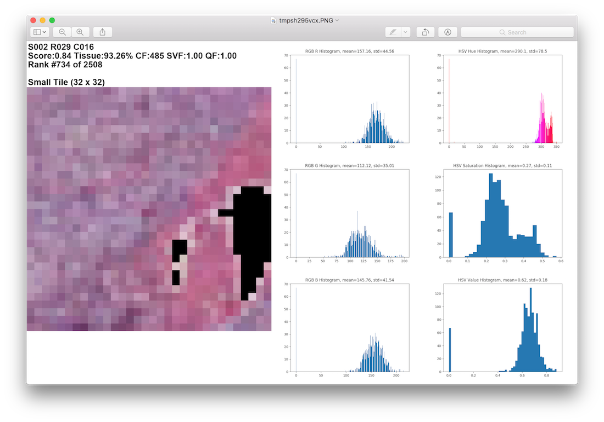 |


Here we see RGB and HSV histograms for the full-sized 1,024x1,024 tile at slide 2, row 29,
column 16. Notice that the small tile pixels offer a reasonable approximation of the colors
present on the large tile. Also, notice that the masked-out pixels in the small tissue
correspond fairly accurately with the non-tissue regions of the large tile.

| **Large Tile Color Histograms** |
| -------------------- |
| 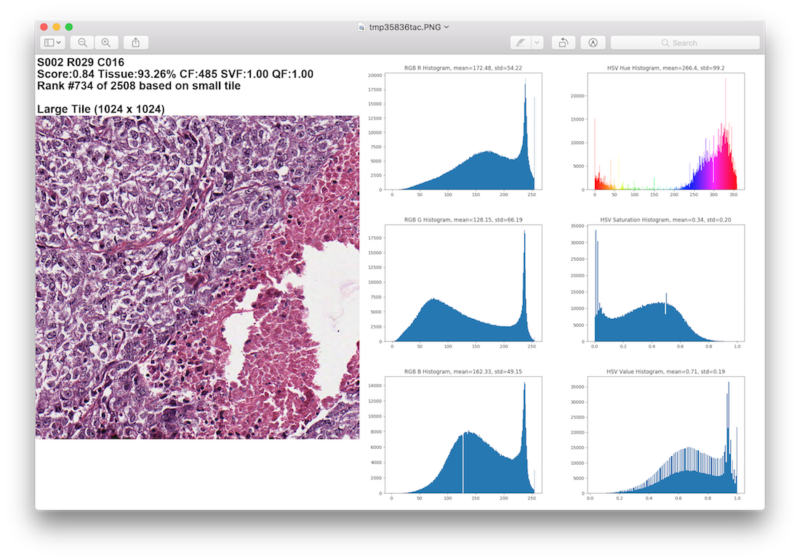 |


If the `save_data` parameter of the `summary_and_tiles()` function is set to `True`, detailed data about
the slide tiles are saved in `csv` format.

```
tiles.summary_and_tiles(2, display=True, save_summary=True, save_data=True, save_top_tiles=False)
```

For slide #2, this generates a `TUPAC-TR-002-32x-57922x44329-1810x1385-tile_data.csv` file.

| **Tile Data** |
| ------------- |
| 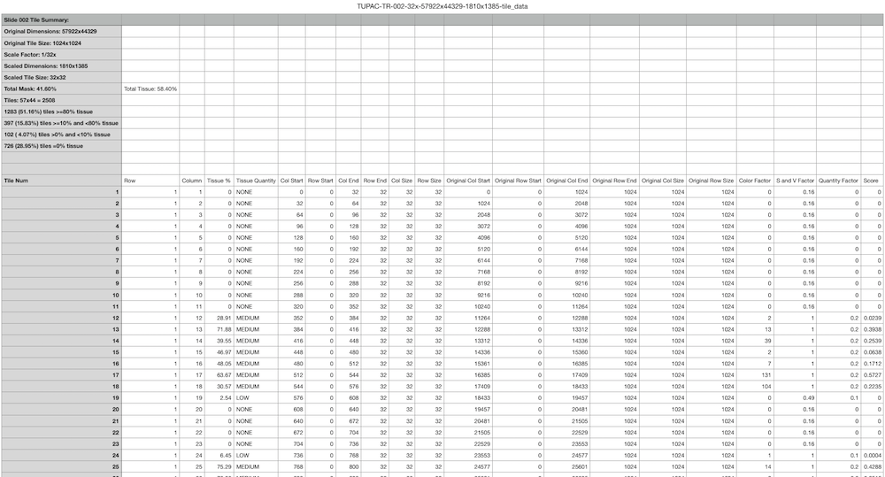 |


In addition to the tile tissue heat map summaries, the `summary_and_tiles()` function generates
top tile summaries. By default it highlights the top 50 scoring tiles. The number of top tiles can be
controlled by the `NUM_TOP_TILES` constant.

```
tiles.summary_and_tiles(2, display=True, save_summary=True, save_data=False, save_top_tiles=False)
```

Here we see the top tile summary on the masked image for slide #2. Notice that tiles with high
tissue percentages and hematoxylin-stained tissue are favored over tiles with low tissue
percentages and eosin-stained tissue. Notice that statistics about the top 50 scoring tiles are
displayed to the right of the image.

| **Top Tiles** |
| ------------- |
|  |


For visual inspection, the top tile summary is also generated over the original slide image, as
we see here.

| **Top Tiles on Original** |
| ------------------------- |
| 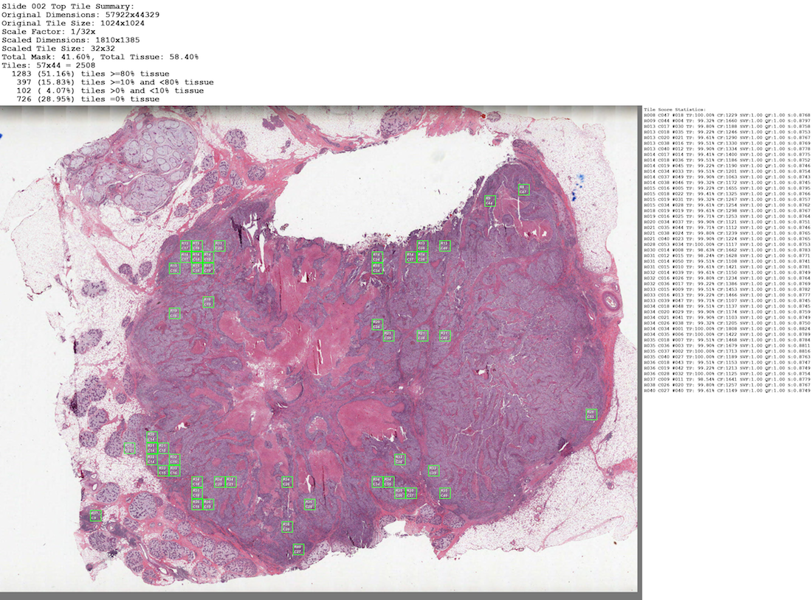 |


When analyzing top tile results, it can be useful to see the tissue percentage heat map
of surrounding tiles. This can be accomplished by setting the `BORDER_ALL_TILES_IN_TOP_TILE_SUMMARY`
constant to `True`. Likewise, it can useful to see the row and column coordinates of all tiles,
which can be accomplished using the `LABEL_ALL_TILES_IN_TOP_TILE_SUMMARY` constant with a value of
`True`.

| **Top Tile Borders** | **Top Tile Labels** |
| -------------------- | -------------------- |
|  |  |


Here we see a section of a top tile summary that features both the tile tissue heat map and the
row and column labels.

| **Top Tile Labels and Borders** |
| ------------------------- |
|  |

## Top Tile Retrieval

Top tiles can be saved as files in batch mode or retrieved dynamically. In batch mode,
tiling, scoring, and saving the 1,000 tissue percentage heat map summaries (2 per image),
the 1,000 top tile summaries (2 per image), the 2,000 thumbnails, and 25,000 1Kx1K tiles
(50 per image) takes approximately 2 hours.

If the `save_top_tiles` parameter of the `summary_and_tiles()` function is set to `True`,
the top-ranking tiles for the specified slide will be saved to the file system.

```
tiles.summary_and_tiles(2, display=True, save_summary=True, save_data=False, save_top_tiles=True)
```

In general, it is recommended that the user utilize the `singleprocess_filtered_images_to_tiles()`
and `multiprocess_filtered_images_to_tiles()` functions in `wsi/tiles.py`. These functions
generate convenient HTML pages for investigating the tiles generated for a slide set. The
`multiprocess_filtered_images_to_tiles()` utilizes multiprocessing for added performance. If
no `image_num_list` parameter is provided, all images in the dataset will be processed.

Here, we generate the top 50 tiles for slides #1, #2, and #3.

```
tiles.multiprocess_filtered_images_to_tiles(image_num_list=[1, 2, 3])
```

On the generated `tiles.html` page, we see the original slide images, the images after filtering,
the tissue percentage heat map summaries on the filtered images and the original images, tile summary
data including links to the generated `csv` file for each slide, the top tile summaries on the
filtered images and the original images, and links to the top 50 tile files for each slide.

| **Tiles Page** |
| ------------- |
|  |


The full-size 1,024x1,024 tiles can be investigated using the top tile links. Here we see the
two top-scoring tiles on slide 2 at row 34, column 34 and row 35, column 37.

| **Slide #1, Top Tile #1** | **Slide #1, Top Tile #2** |
| ------------------------ | ------------------------------------ |
|  | 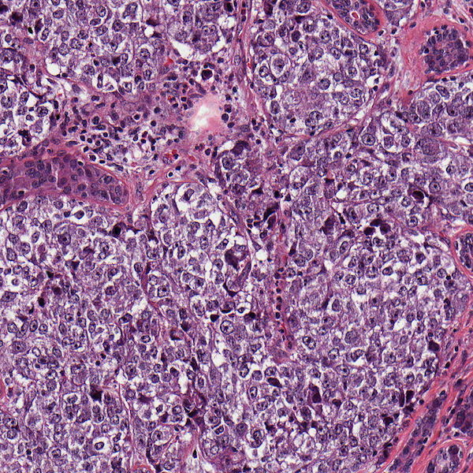 |


Tiles can also be retrieved dynamically. In dynamic tile retrieval, slides are scaled down,
filtered, tiled, and scored all in-memory. The top tiles can then be retrieved from the
original WSI file and stored in-memory. No intermediate files are written to the file system
during dynamic tile retrieval.

Here, we dynamically obtain a `TileSummary` object by calling `dynamic_tiles()` for
slide #2. We obtain the top-scoring tiles from `tile_summary`, outputting status
information about each tile. The status information includes the tile number, the row
number, the column number, the tissue percentage, and the tile score.

```
tile_summary = tiles.dynamic_tiles(2)
top_tiles = tile_summary.top_tiles()
for t in top_tiles:
  print(t)
```

In the console output, we see that the original `svs` file is opened, the slide is
scaled down, and our series of filters is run on the scaled-down image. After that,
the tiles are scored, and we see status information about the top 50 tiles for
the slide.

```
Opening Slide #2: ../data/training_slides/TUPAC-TR-002.svs
RGB                  | Time: 0:00:00.007339  Type: uint8   Shape: (1385, 1810, 3)
Filter Green Channel | Time: 0:00:00.005135  Type: bool    Shape: (1385, 1810)
Mask RGB             | Time: 0:00:00.007973  Type: uint8   Shape: (1385, 1810, 3)
Filter Grays         | Time: 0:00:00.073780  Type: bool    Shape: (1385, 1810)
Mask RGB             | Time: 0:00:00.008114  Type: uint8   Shape: (1385, 1810, 3)
Filter Red Pen       | Time: 0:00:00.066007  Type: bool    Shape: (1385, 1810)
Mask RGB             | Time: 0:00:00.007925  Type: uint8   Shape: (1385, 1810, 3)
Filter Green Pen     | Time: 0:00:00.105854  Type: bool    Shape: (1385, 1810)
Mask RGB             | Time: 0:00:00.008034  Type: uint8   Shape: (1385, 1810, 3)
Filter Blue Pen      | Time: 0:00:00.087092  Type: bool    Shape: (1385, 1810)
Mask RGB             | Time: 0:00:00.007963  Type: uint8   Shape: (1385, 1810, 3)
Mask RGB             | Time: 0:00:00.007807  Type: uint8   Shape: (1385, 1810, 3)
Remove Small Objs    | Time: 0:00:00.034308  Type: bool    Shape: (1385, 1810)
Mask RGB             | Time: 0:00:00.007814  Type: uint8   Shape: (1385, 1810, 3)
[Tile #1915, Row #34, Column #34, Tissue 100.00%, Score 0.8824]
[Tile #1975, Row #35, Column #37, Tissue 100.00%, Score 0.8816]
[Tile #1974, Row #35, Column #36, Tissue 99.90%, Score 0.8811]
[Tile #500, Row #9, Column #44, Tissue 99.32%, Score 0.8797]
[Tile #814, Row #15, Column #16, Tissue 99.22%, Score 0.8795]
[Tile #1916, Row #34, Column #35, Tissue 100.00%, Score 0.8789]
[Tile #1956, Row #35, Column #18, Tissue 99.51%, Score 0.8784]
[Tile #1667, Row #30, Column #14, Tissue 98.63%, Score 0.8783]
[Tile #1839, Row #33, Column #15, Tissue 99.51%, Score 0.8782]
[Tile #1725, Row #31, Column #15, Tissue 99.61%, Score 0.8781]
[Tile #2061, Row #37, Column #9, Tissue 98.54%, Score 0.8779]
[Tile #724, Row #13, Column #40, Tissue 99.90%, Score 0.8778]
[Tile #1840, Row #33, Column #16, Tissue 99.22%, Score 0.8777]
[Tile #758, Row #14, Column #17, Tissue 99.41%, Score 0.8775]
[Tile #1722, Row #31, Column #12, Tissue 98.24%, Score 0.8771]
[Tile #722, Row #13, Column #38, Tissue 99.51%, Score 0.8769]
[Tile #1803, Row #32, Column #36, Tissue 99.22%, Score 0.8769]
[Tile #446, Row #8, Column #47, Tissue 100.00%, Score 0.8768]
[Tile #988, Row #18, Column #19, Tissue 99.61%, Score 0.8767]
[Tile #2135, Row #38, Column #26, Tissue 99.80%, Score 0.8767]
[Tile #704, Row #13, Column #20, Tissue 99.61%, Score 0.8767]
[Tile #816, Row #15, Column #18, Tissue 99.41%, Score 0.8766]
[Tile #1180, Row #21, Column #40, Tissue 99.90%, Score 0.8765]
[Tile #1178, Row #21, Column #38, Tissue 99.80%, Score 0.8765]
[Tile #1042, Row #19, Column #16, Tissue 99.71%, Score 0.8764]
[Tile #1783, Row #32, Column #16, Tissue 99.80%, Score 0.8764]
[Tile #1978, Row #35, Column #40, Tissue 100.00%, Score 0.8763]
[Tile #832, Row #15, Column #34, Tissue 99.61%, Score 0.8762]
[Tile #1901, Row #34, Column #20, Tissue 99.90%, Score 0.8759]
[Tile #701, Row #13, Column #17, Tissue 99.80%, Score 0.8758]
[Tile #817, Row #15, Column #19, Tissue 99.32%, Score 0.8757]
[Tile #2023, Row #36, Column #28, Tissue 100.00%, Score 0.8754]
[Tile #775, Row #14, Column #34, Tissue 99.51%, Score 0.8754]
[Tile #1592, Row #28, Column #53, Tissue 100.00%, Score 0.8753]
[Tile #702, Row #13, Column #18, Tissue 99.22%, Score 0.8753]
[Tile #759, Row #14, Column #18, Tissue 99.51%, Score 0.8752]
[Tile #1117, Row #20, Column #34, Tissue 99.90%, Score 0.8751]
[Tile #1907, Row #34, Column #26, Tissue 99.32%, Score 0.8750]
[Tile #1781, Row #32, Column #14, Tissue 99.61%, Score 0.8749]
[Tile #2250, Row #40, Column #27, Tissue 99.61%, Score 0.8749]
[Tile #1902, Row #34, Column #21, Tissue 99.90%, Score 0.8749]
[Tile #2014, Row #36, Column #19, Tissue 99.22%, Score 0.8749]
[Tile #2013, Row #36, Column #18, Tissue 99.51%, Score 0.8747]
[Tile #1175, Row #21, Column #35, Tissue 99.71%, Score 0.8746]
[Tile #760, Row #14, Column #19, Tissue 99.22%, Score 0.8746]
[Tile #779, Row #14, Column #38, Tissue 99.32%, Score 0.8745]
[Tile #1863, Row #33, Column #39, Tissue 99.71%, Score 0.8745]
[Tile #1899, Row #34, Column #18, Tissue 99.51%, Score 0.8745]
[Tile #778, Row #14, Column #37, Tissue 99.90%, Score 0.8743]
[Tile #1724, Row #31, Column #14, Tissue 99.51%, Score 0.8741]
```

If we'd like to obtain each tile as a NumPy array, we can do
so by calling the `get_np_tile()` function on the `Tile`
object.

```
tile_summary = tiles.dynamic_tiles(2)
top_tiles = tile_summary.top_tiles()
for t in top_tiles:
  print(t)
  np_tile = t.get_np_tile()
```

As a further example, here we dynamically retrieve the tiles
for slide #4 and display the top 2 tiles along with their
RGB and HSV histograms.

```
tile_summary = tiles.dynamic_tiles(4)
top = tile_summary.top_tiles()[:2]
for t in top:
  t.display_with_histograms()
```

| **Slide #4, Top Tile #1** | **Slide #4, Top Tile #2** |
| ------------------------ | ------------------------------------ |
|  | 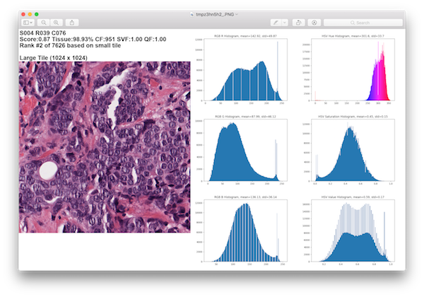 |


Next, we dynamically retrieve the tiles for slide #2. We
display (not shown) the tile tissue heat map and top tile summaries and
then obtain the tiles ordered by tissue percentage.
We display the 1,000<sup>th</sup> and 1,500<sup>th</sup> tiles by tissue percentage.

```
tile_summary = tiles.dynamic_tiles(2)
tile_summary.display_summaries()
ts = tile_summary.tiles_by_tissue_percentage()
ts[999].display_with_histograms()
ts[1499].display_with_histograms()
```

Here we see the 1,000<sup>th</sup> and 1,500<sup>th</sup> tiles ordered by tissue percentage for slide #2.
Note that the displayed tile rank information is based on score rather than
tissue percentage alone.

| **Slide #2, Tissue Percentage #1000** | **Slide #2, Tissue Percentage #1500** |
| ------------------------ | ------------------------------------ |
|  |  |


Tiles can be retrieved based on position. Here, we display the tiles at row 25, column 30 and row 25, column 31 on slide #2.

```
tile_summary = tiles.dynamic_tiles(2)
tile_summary.get_tile(25, 30).display_tile()
tile_summary.get_tile(25, 31).display_tile()
```

| **Slide #2, Row #25, Column #30** | **Slide #2, Row #25, Column #31** |
| ------------------------ | ------------------------------------ |
| 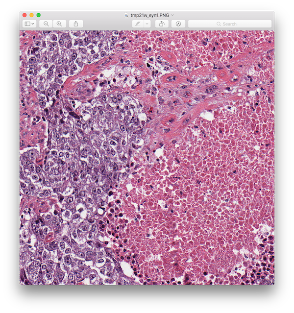 |  |

If an individual tile is required, the `dynamic_tile()` function can be used.

```
tiles.dynamic_tile(2, 25, 32).display_tile()
```

| **Slide #2, Row #25, Column #32** |
| --------------------------------- |
| 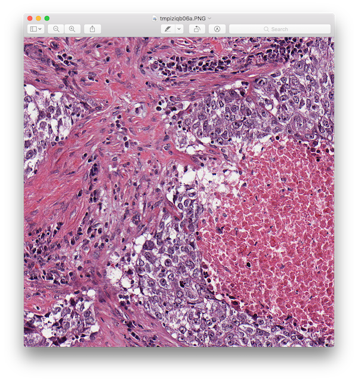 |

If multiple tiles need to be retrieved dynamically, for performance reasons `dynamic_tiles()` is
preferable to `dynamic_tile()`.


## Summary

In this tutorial, we've taken a look at how Python, in particular with packages such as NumPy and
scikit-image, can be used for tissue segmentation in whole-slide images. In order to efficiently process
images in our dataset, we utilized OpenSlide to scale down the slides. Using NumPy arrays, we
investigated a wide variety of image filters and settled on a combination and series of filters that
demonstrated fast, acceptably accurate tissue segmentation for our dataset. Following this, we divided
the filtered images into tiles and scored the tiles based on tissue percentage and color characteristics
such as the degree of hematoxylin staining versus eosin staining. We then demonstrated how we can
retrieve the top-scoring tiles which have high tissue percentages and preferred staining characteristics.
We saw how whole-slide images could be processed in batches or dynamically. Scaling, filtering,
tiling, scoring, and saving the top tiles can be accomplished in batch mode using multiprocessing in
the following manner.

```
slide.multiprocess_training_slides_to_images()
filter.multiprocess_apply_filters_to_images()
tiles.multiprocess_filtered_images_to_tiles()
```

The above code generates HTML filter and tile pages which simplify visual
inspection of the image processing and the final tile results.

Since the average number of pixels per whole-slide image is 7,670,709,629 and we have reduced
the data to the top 50 1,024x1,024 pixel tiles, we have reduced the raw image data down by a
factor of 146x while identifying tiles that have significant potential for further useful
analysis.
